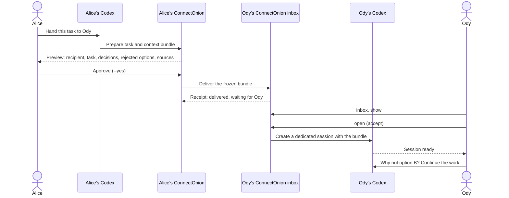

# co handoff - Hand the work to a teammate's Codex

> **Preview, coming next.** `co handoff` is not in any ConnectOnion release yet.
> This page describes the first preview as designed in
> [openonion/connectonion#2351](https://github.com/openonion/connectonion/issues/2351).
> Command names and flags below are the planned shape; the page is replaced by
> the shipped `docs/cli/handoff.md` when the release that carries it is public.
> Until then, check `co handoff --help` on your machine before relying on any line here.

## The scenario: "hand this to Ody"

You have spent an hour with your Codex on a task. You decided things, you
rejected things, and you know why. Now Ody should continue it.

Today that means writing it all down again. With `co handoff` you tell your
Codex:

> Hand the login task we just discussed to Ody.

ConnectOnion prepares the task and the context it needs, shows you exactly what
would leave your machine, and sends it only when you say so. On Ody's machine a
dedicated Codex session is created with that context already in it. Ody opens it,
asks "why not option B?", gets an answer from the material you shared, and
carries on. Nobody rewrites the background.

Codex stays each person's working interface. There is no shared folder to keep
up and no document to write by hand.

## What a bundle contains

A handoff is one frozen bundle, prepared from the current Codex session and the
relevant [co rem](/rem) context:

| Part | What it holds |
|---|---|
| Task | The objective and what "done" means |
| Where it stands | What is finished, in progress, and already tried |
| Decided | Each confirmed decision, with its reason |
| **Rejected** | Each option you dropped, and why. This is what the recipient asks about first |
| Constraints | Limits the work must respect |
| Open questions | What is still undecided, and who is waiting on it |
| Sources | Short excerpts and stable references (repository, branch, commit, PR) |

Proposals are kept apart from confirmed decisions. Anything missing or
uncertain is marked as such, not filled in with a guess.

What is **not** in a bundle: your system instructions, credentials, execution
privileges, other conversations, hidden model reasoning, or paths into your
private filesystem.

Sending freezes the bundle at one version. If you edit it, the earlier approval
no longer applies to it.

## Send: preview first, then `--yes`

Like every `co` command that sends something, `co handoff` previews before it
acts. The first run prints the bundle and sends nothing; you read it, then
confirm.

Planned shape:

```bash
co handoff send ody            # preview: recipient, task, decisions, rejected options, sources
co handoff send ody --yes      # send exactly what the preview showed
```

The preview names the recipient, the requested work, the decisions and
constraints, and the exact source material included. You can approve it, edit
it, or decline. No answer means nothing is sent.

Delivery is not execution. After sending you see the real status: delivered and
waiting for Ody, accepted, session ready.

## Receive: inbox, show, open

On Ody's machine the handoff lands in an inbox first. Nothing runs and no
session is created until Ody accepts it.

Planned shape:

```bash
co handoff inbox               # handoffs waiting for you
co handoff show <id>           # read the bundle: task, decisions, rejected options, sources
co handoff open <id>           # accept, and open the Codex session that continues it
```

`open` creates a dedicated Codex session on Ody's machine with the brief and its
evidence in the task workspace. Ody's own approval policy decides whether the
session starts working at once or waits for him. Opening the same handoff twice
returns the same session; it does not create a second one.

## Privacy: the preview is what leaves

- **The preview shows exactly what leaves your machine.** The bundle that is
  sent is the version you saw, byte for byte. An edit makes a new version that
  needs its own approval.
- **The AI prepares; you authorize.** Choosing what context is relevant saves
  you work, but it does not grant permission to share it.
- **The recipient gets text, not access.** Ody receives the bundle, not a live
  link into your co rem, your session history, or your machine.
- **Your instructions do not travel as orders.** Shared text cannot override
  Ody's execution policy. Running tools or changing code on his machine stays
  under his own approvals.
- **Sent is sent.** Withdrawing a handoff stops future access, but it cannot
  erase a copy that was already delivered.

## How it flows

The first preview covers one known pair of collaborators: your Codex session,
one handoff, Ody's Codex session. This is the part of the
[#2351](https://github.com/openonion/connectonion/issues/2351) design that the
first preview targets:



Not in the first preview, and not described here as working: standing
auto-approval grants, sending questions and results back to the sender through
the handoff, finding a teammate's agent from their email
([#2353](https://github.com/openonion/connectonion/issues/2353)), and
notifications that pop up inside Codex.

## See also

- [co rem](/rem) - the context a handoff draws on
- [Agents know co](/cli/agent-index) - how Codex learns that `co handoff` exists
- [co skills](/cli/skills) - ConnectOnion's skills in Claude Code and Codex
