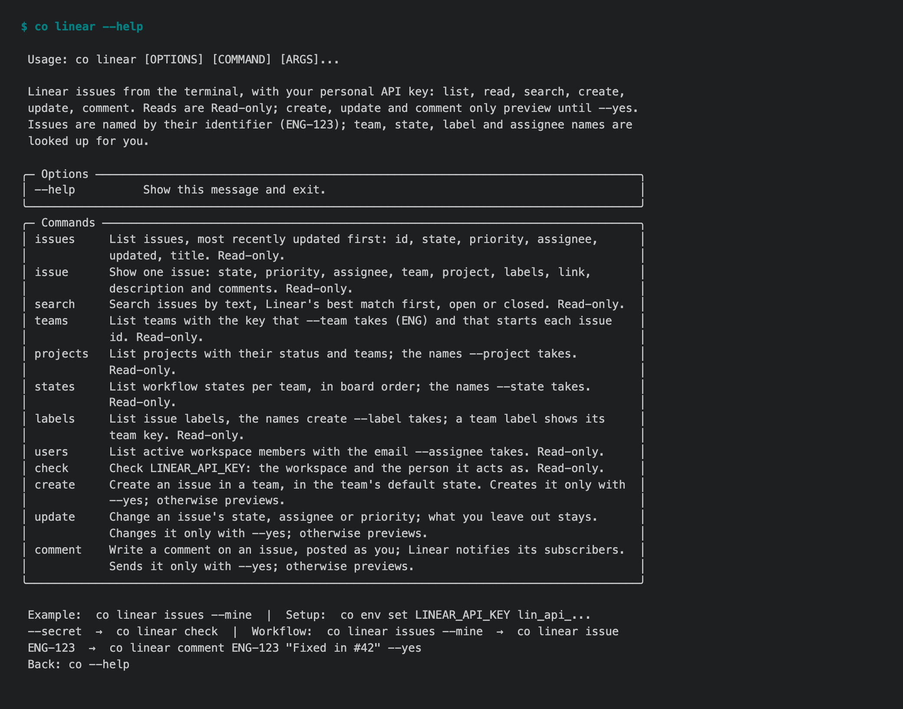
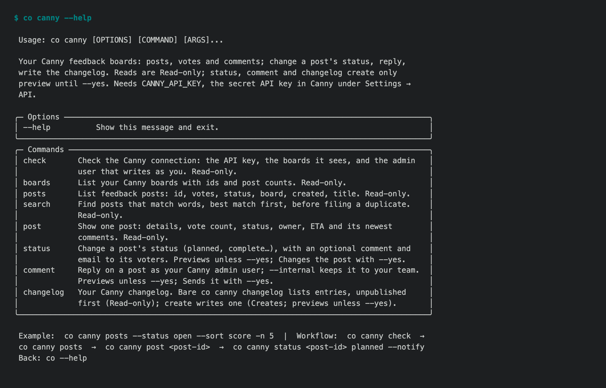
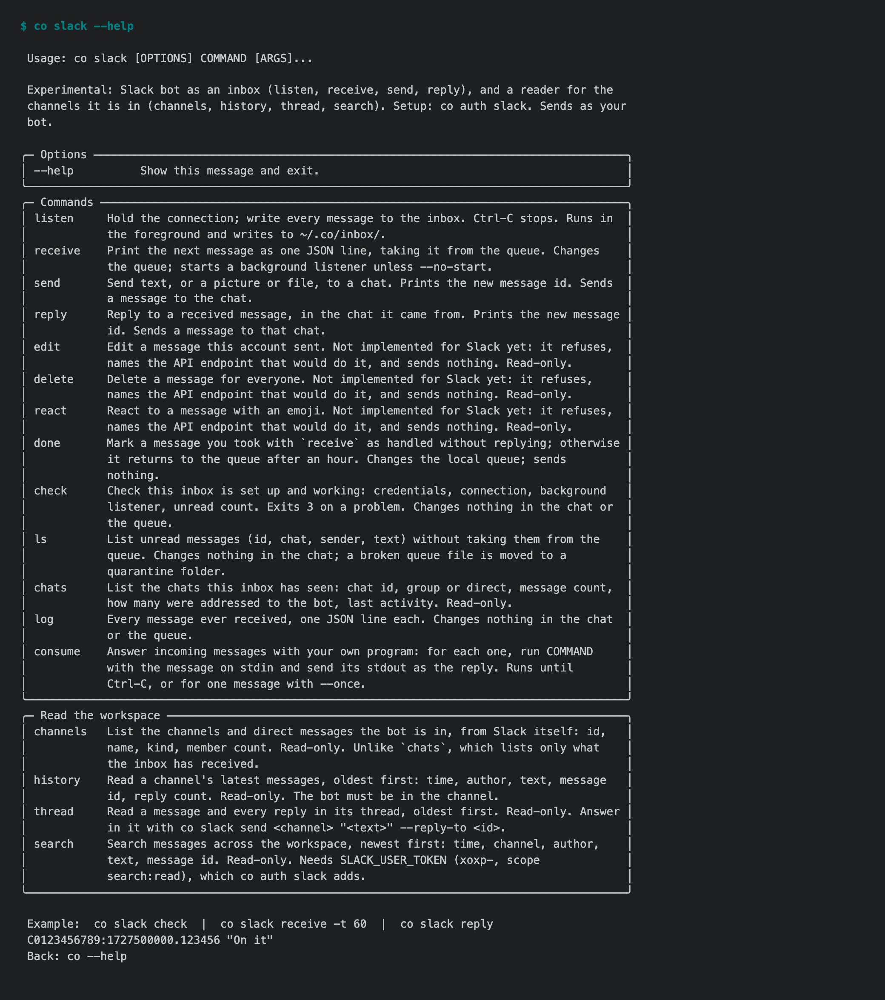

# 1.8.10 — Linear, Canny and Slack, on their own APIs

A stable patch on the 1.8 line. It adds three services the owner asked for,
each built on the service's own API rather than its MCP server: Linear's
GraphQL API, Canny's REST API and Slack's Web API. Writes preview what they
will do and change nothing until `--yes`. Every command ends by naming the
next one to run.

How it was checked: on real accounts made for this release: a Linear
workspace, a Canny company on the Free plan and a Slack workspace. The
real-account tests (9) pass on the release branch, with every key read from
the encrypted store and nothing exported. Every change also went through CI on
Python 3.10 to 3.13, Windows and macOS, on `main` first and then on
`release/1.8`.



## New in 1.8.10

- **`co linear`**: your Linear issues from the terminal.
  - `issues [--mine] [--team CON] [--state …]`, `issue CON-12`, `search`.
  - `create`, `update` and `comment`, which preview until `--yes`.
  - `teams`, `projects`, `states`, `labels` and `users` list the names the
    other commands take.
  - Setup: `co env set LINEAR_API_KEY lin_api_… --secret`, then
    `co linear check`.
- **`co canny`**: your feedback boards.
  - `boards`, `posts --status open --sort score`, `post <id>`, `search`.
  - `status <id> planned --notify`, `comment`, and `changelog` /
    `changelog create`.
  - Changing a status or commenting needs your Canny user id: find it with
    `co canny check --email you@…`.
- **`co slack` reads the workspace.**
  - `channels`, `history <channel>`, `thread <channel>:<ts>` and
    `search "…" [--in ops] [--from alice]`.
  - Each message carries the id that `co slack send … --reply-to` takes.
  - **`co auth slack`** sets the app up from one link with the manifest
    filled in. You paste the tokens, and it checks each one with Slack before
    saving anything.
  - The inbox verbs (`listen`, `receive`, `reply`) stay Experimental.





## Fixed

- **A value saved with `co env set … --secret` reaches the command that needs
  it.** `--secret` encrypts into `~/.co/keys/secrets/`, and until now only
  `co env get` opened that store. Every other command read the shell and
  `keys.env`, so a key saved the way `co env set --help` shows was reported as
  not set. `environment.setting()` checks the process, then the selected file,
  then the store, in that order. The new commands and the Slack inbox read
  their keys through it.

- **urllib3 2.8.0.** Three advisories published against 2.7.0 (CVE-2026-97687,
  -97688, -97689); the declared floor and the lock now require 2.8.0, as on
  `main` (#2007).

## Known limits

- `co linear` reads one page of up to 250 records per listing.
- Canny can hold a post it rates as likely spam: `posts/retrieve` returns it,
  but no listing shows it until an admin approves it. `docs/cli/canny.md`
  explains how to tell "not listed" from "does not exist".
- Canny's Free plan has no internal comments. `--internal` says so and offers
  the public comment instead.
- Slack's `--from`, private channels and rate-limit replies were not exercised
  live.

## Upgrade

```bash
python -m pip install --upgrade 'connectonion==1.8.10'
```

Forward-port ledger: #2086. Every change here was written against `main`
first, and reaches it through #2082, #2063, #2072 and #2075.
