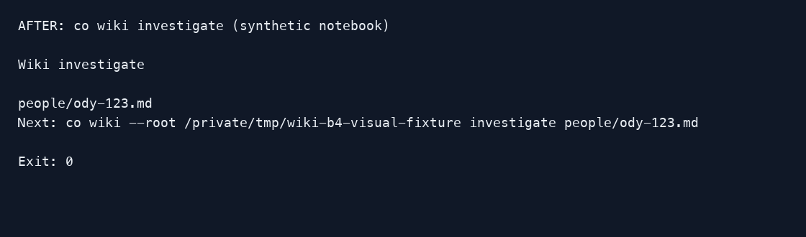

# 1.8.7b4 — Find the next Wiki command

Wiki help now teaches the workflow: build a map, discover an actual page,
investigate it, inspect the evidence, and update deliberately. Running
`co wiki investigate` without arguments lists available pages without starting
a model. An exact title or email can select a unique page; ambiguous names
show choices instead of guessing. Default results use readable text. Scripts
can request the existing JSON envelope explicitly.

```sh
python -m pip install --upgrade --pre connectonion==1.8.7b4
co wiki --help
co wiki investigate
```

Copy the printed Next command to investigate an existing page. Init builds
People, Organizations, Projects and Skills maps. Organization identities are
unverified observed domains, not inferred employment. Skill pages include
verbatim source snapshots with provenance; original Skills are not executed.

This preview also includes stricter project-page validation and staged
maintenance: invalid updates preserve the live pages and pending corrections.
Source citations, mapped metadata and canonical sections are checked before
promotion. These checks do not establish factual truth; reviewers still need
to examine unsupported timing and interpretation in generated prose.

Help and the overview share one workflow definition, and the CLI design Skill
now teaches this approach. Source authorization through `start` still also
installs background scheduling. It is not part of initialization or discovery.

Validation includes the Wiki regressions and text-only model evaluations:
16/16 output-tip cases and 7/7 help-only choices passed. These do not substitute
for real workflow or factual-quality acceptance. Release and installed-package
checks are recorded in the [b4 acceptance record](../acceptance/1.8.7b4.md).
Stable remains 1.8.6; this is an opt-in preview.



[Previous preview behavior](assets/v1.8.7b4/before.png).
