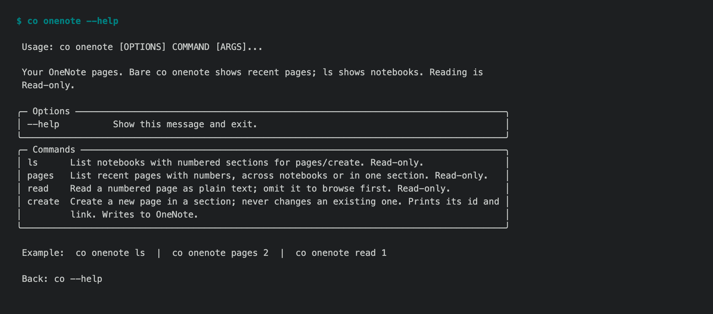

# 1.8.9 — fixes found in real use

The stable release after 1.8.8. Twenty-three previews (1.8.9b1 through b23) fed
it, on a line whose job was to fix what real use turned up
([#1722](https://github.com/openonion/connectonion/issues/1722)).

How it was checked, plainly: 1.8.8 went stable after three rounds of strangers
installing it into empty profiles. 1.8.9 did not have that round. The owner
chose to ship once the feature-complete preview (1.8.9b19) and its follow-ups
had been used on the owner's own accounts, and to fix what turns up in 1.9.
Checked live: WhatsApp pictures and files, and a listener that restarts itself
after an upgrade with its flags kept; `co auth microsoft` and OneNote on a
personal outlook.com account, which found four bugs fixed in 1.8.9b20;
`co search` and `co fetch`; Chinese typed into an empty Feishu editor; and every
change through CI on Python 3.10 to 3.13, Windows and macOS.



## Safer by default

- **A chat turn cannot grant itself more.** With nobody at an approval dialog,
  a call nothing granted is refused in every mode; read-only used to let it
  through. A chat turn no longer runs a command the policy has no rule for.
  `allowed: false` in `.co/host.yaml` denies, even inside `a && b`, and beats
  any allow. Editing a skill's `SKILL.md` frontmatter is granting, so a chat or
  unattended turn cannot do it (#1881, #1873).

## New in 1.8.9

- **One consent for Microsoft.** `co auth microsoft` asks once for everything
  a user can grant without an administrator: mail, calendar, contacts, files,
  OneNote, To Do and Teams chats (read). If that is refused it falls back to the
  core set and says what was left out; `--core` asks for the core set only.
- **OneNote.** `co onenote ls | pages | read | create` and `OneNote()` for
  agents, with numbered navigation: `co onenote pages 2`, `co onenote read 1`.
  Works on work, school and personal Microsoft accounts.
- **Search and read the web.** `co search` and `co fetch`, and `web_search` /
  `web_fetch` for `co ai`; `-e ddg` is free.
- **Watches in `co ai`.** A conversation can watch a background task or check
  something on a schedule, and the result comes back into the same session.
- **`co outlook reply --all`** answers a group thread in the same thread and
  leaves you off the Cc of your own reply.
- **WhatsApp pictures and files** with `--image` and `--file` on `send` and
  `reply`. Listeners record their version, restart themselves after an
  upgrade, keep `--raw`, and log why they stopped.
- **`co audit`** walks any CLI's `--help` pages and scores them against a
  help contract; every `co` page passes it.
- **Gemini 3.8 is the default model.** At a zero balance `co status` names the
  free `co/gemma` and a local `ollama/<model>`.
- **The paid browser is Chromium 154** and reports the screen it really runs
  on. `co browser import` brings in a Chrome login.

## Experimental, and labelled so

These ship in 1.8.9 and say "Experimental" in their help. Their commands may
change before they are declared stable:

- **Personal Wiki** (`co wiki`), long-term supported from 1.9.0. In this line
  it learned to name people and organisations properly, keep a 90-day map with
  private mail materials, budget itself on the Codex week, write person and
  project pages tested against benchmark suites, and wait for the notebook
  instead of losing a finished page.
- **`co slack`**, new: a Slack bot as an inbox over Socket Mode. Tested against
  Slack's documented events, not yet a live workspace.
  
- **`co discord`**, and `listen` / `receive` / `reply` on `co telegram`.
- **`co claude`** and **`co tiktok`**, as in 1.8.8.

## Fixed in real use

- OneNote said "authorization expired" on outlook.com accounts, forever: the
  consent asked for a work-or-school-only scope. It now asks for the one
  personal accounts accept, and a refusal says why (#1910).
- A slow OneNote section timed out after 5 seconds and printed a traceback; a
  page of clipped code lost its line breaks.
- Chinese typed into an empty Feishu, Lark or Slate editor came out twice (#1877).
- A restarted WhatsApp listener dropped `--raw`, and a listener started from a
  source checkout ran the checkout instead of the installed version.
- A Google library's Python 3.10 notice printed above every command.

## Known limits

- Investigating a very large Wiki subject still costs millions of tokens (one
  real subject: 8.2M tokens over three and a half hours). Searching prepared
  evidence instead of summarising all of it is 1.9 (#1850).
- `co slack` has not met a real workspace; `edit`, `delete` and `react` refuse.
- Teams: chats can be read with the new consent, but there is no `co teams`
  yet (#1907).
- WhatsApp through the Cloud API waits until after 2.0.

## Install

```sh
python -m pip install --upgrade connectonion
co --version    # co 1.8.9
```

See the preview notes for the full history: [1.8.9b23](1.8.9b23.md) back to
[1.8.9b1](1.8.9b1.md).
