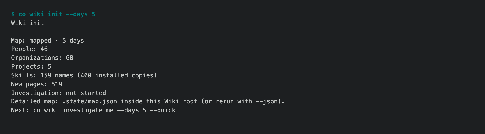

# 1.8.9b11 — a five-day Personal Wiki first pass

An opt-in preview on the 1.8.9 line. Stable remains 1.8.8. This release
improves the experimental Wiki's first run; it does not claim that every
generated page is factually verified.

## What changed

`co wiki init --days 5` now prints a concise map and progress instead of
thousands of address and path rows. Its next command retains the five-day
scope. Repeating the map after a project investigation no longer adds a
duplicate project path, and generated Wiki task copies are excluded from the
project directory.



`co wiki investigate me --days 5 --quick` offers a bounded first owner page.
It states when coverage is partial; it is a draft for review, not a verified
biography. Investigations report their current stage, progress and usage, and
full extraction checkpoints make retries possible. A project page records
when the requested session window had no matching messages, rather than
silently treating older project files as current conversation evidence.

## Acceptance and limits

An isolated real five-day map produced 46 People, 68 Organizations, five
Projects and 159 distinct Skill names from 400 installed copies. A later
rerun created zero pages and kept an investigated project page byte-for-byte.
The quick owner page completed with 24 of 60 evidence items covered; it
reported 169,548 input tokens, compared with 429,022 in an earlier quick
trial. The deep project pass took 1,041.8 seconds and reported 1,120,354
input tokens. Those figures describe the observed runs, not a general cost
guarantee. Sampled citations were checked, but no automatic factual quality
certification is implied.

See the [five-day acceptance report](../testing/wiki-onboarding-five-day-2026-09-26.md)
for commands, quality review and remaining issues. Source data and personal
drafts are not included in the release.

## Install

```sh
python -m pip install --upgrade 'connectonion==1.8.9b11'
co wiki init --days 5
co wiki investigate me --days 5 --quick
```
