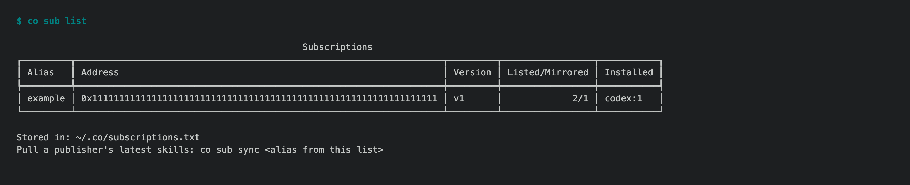
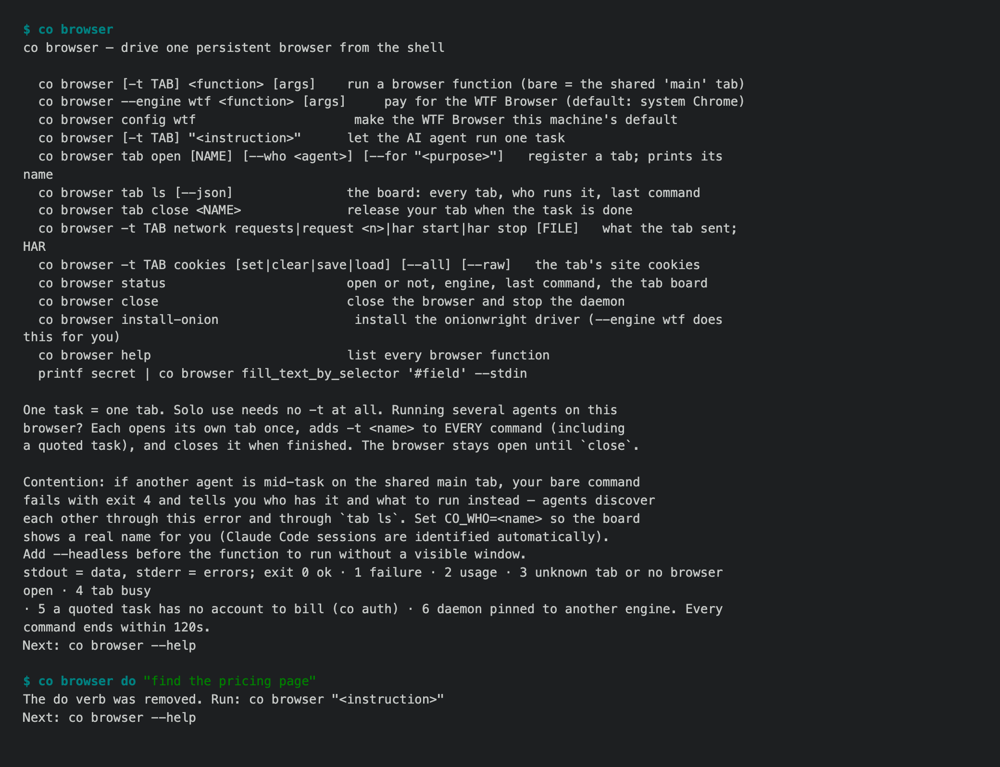

# 1.8.9b12 — subscribed skills and browser tasks

An opt-in preview on the 1.8.9 fix line. Stable remains 1.8.8.

## Fixed

- `co sub sync` stages a replacement bundle, removes withdrawn or withheld
  skills from owned installations, and keeps the local alias pinned when a
  publisher renames theirs. `co sub list` distinguishes listed, mirrored, and
  installed skills. Existing user files, directories, and unrelated symlinks
  with matching names are preserved (#1785).



- Published skill companion files travel with the signed body and are mirrored
  only after verification. Active subscriptions are visible to `co ai` under
  `<local-alias>-<skill>` (#1785).
- Natural-language browser tasks now run as
  `co browser "find the pricing page"`. The former `co browser do` form exits
  with a migration hint; direct browser functions keep their syntax (#1786).



## Rollout dependency

The relay must accept and serve signed companion files before this SDK preview
is published. A subscriber refuses a profile whose signed files are omitted or
changed by the relay.

## Install after publication

```sh
python -m pip install --upgrade 'connectonion==1.8.9b12'
co --version
```
