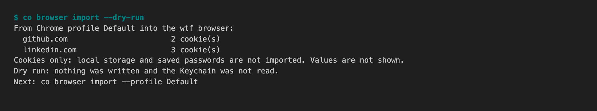
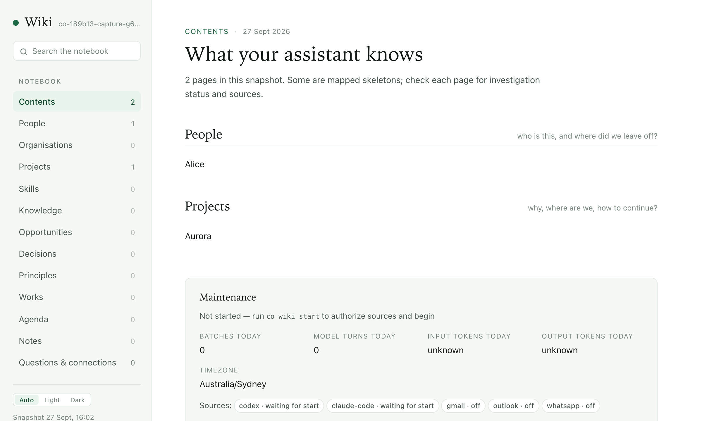

# 1.8.9b13 — Chrome logins, and a wiki that opens

An opt-in preview on the 1.8.9 fix line. Stable remains 1.8.8.

## New

- `co browser import` carries the logins you already have in Google Chrome
  into the co browser profile, so moving to the paid WTF Browser does not mean
  signing in again from a new browser — the step some sites flag (#1477).
  `--dry-run` lists sites and cookie counts without touching the Keychain or a
  browser; a real import asks once, decrypts Chrome's cookies with the "Chrome
  Safe Storage" key, and writes each site through the target browser's own
  cookie API. Chrome's profile is never modified and cookie values are never
  printed.



- A site the target browser is already signed in to is left alone, so an
  import never switches an account in use. Signed in means a login cookie
  (`user_session` on GitHub, `li_at` on LinkedIn, and so on), not any cookie
  from an earlier visit; `--replace` imports over a real login on purpose.

## Fixed

- `co wiki open` opens the local snapshot again. It had started opening
  `chat.openonion.ai/<address>/wiki`, a page that did not load when the Host
  was not running (#1828). Opening locally is the default and works offline;
  the live view through your `co ai` Host is `co wiki open --live`, and falls
  back to the snapshot, saying why, when the Host does not answer.



- The paid browser no longer refuses to start because the free browser's
  profile is in use; each engine checks its own profile lock.
- An unanswered or denied Keychain dialog ends the import with a sentence and
  exit 1 instead of a traceback.
- Benchmarks pass the given context to the evaluated Agent (#1816).

## Limits

The import is macOS and Google Chrome only, and cookies only: local storage,
saved passwords, history and extensions are not imported. Sites that bind a
session to the device (Google, some banks) may still ask you to sign in.

## Install

```sh
python -m pip install --upgrade 'connectonion==1.8.9b13'
co --version
```
