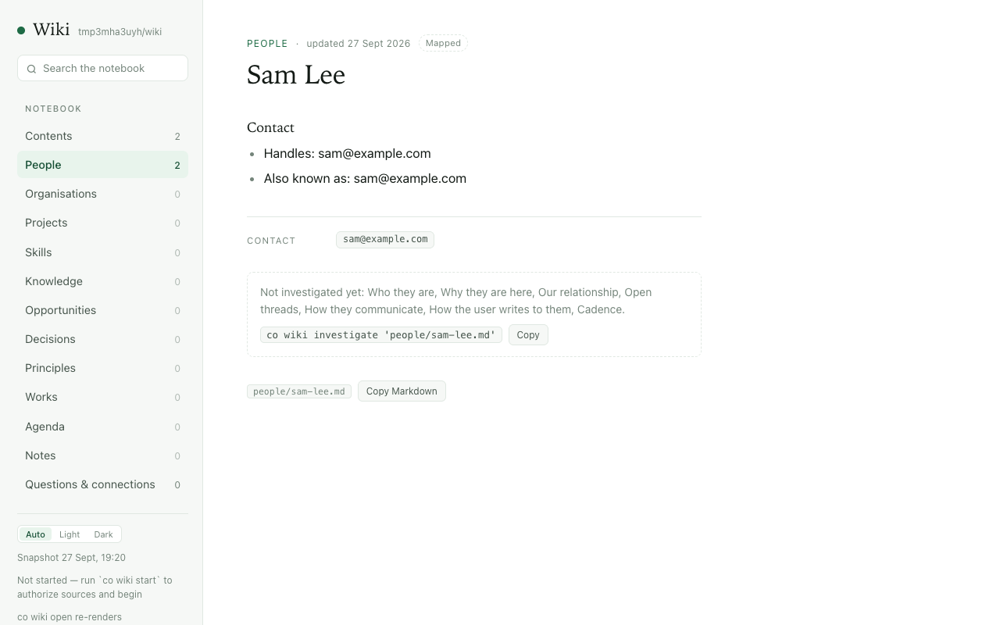

# 1.8.9b15 — The Wiki knows what it can spend

An opt-in preview on the 1.8.9 fix line
([#1722](https://github.com/openonion/connectonion/issues/1722)). Stable is 1.8.8.

## Investigation spends a share of your week

The Wiki now reads the same weekly meter Codex shows you, and budgets on it
(#1843). `co wiki status` shows how much of the week is used and when it
resets.

```sh
co wiki investigate all --list        # the order, busiest first; runs no model
co wiki investigate all --budget 10   # stops starting pages after 10 points of your week
```

`all` is one queue over people, projects and organisations, the same order
the nightly round uses (#1842). Every investigation now counts toward the
weekly budget, including the ones you start by hand. A run stops at its own
`--budget`, at investigation's weekly budget (10 points by default), or when
the week reaches 70%, and says which one stopped it.

## Pages open on what is known



A page the map just made used to open on ten lines of "Unknown". Known facts
now come first, and the empty sections are named once, with the command that
fills them (#1836).

## The map and the nightly update take turns

`co wiki init` now holds the same lock as the nightly update (#1855). On the
owner's notebook the two ran at the same moment: the map renamed a page while
the update was writing it, the batch failed, and 40 messages were skipped. Now
whichever starts second is told the Wiki is busy, and nothing is written.

## Hosted agents keep their instructions

A hosted session that resumed from its id dropped the agent's system prompt,
so an agent told "your name is Zephyr" answered "Gemini" (#1766). Every turn
now carries it.

## Install

```sh
python -m pip install --upgrade --pre 'connectonion==1.8.9b15'
co wiki status
```

## Known limits

- Investigating a large page is still expensive, so a 10-point budget covers
  only a few pages. Investigation reading prepared evidence instead of digests
  is the fix (#1850).
- The map still counts the `~/projects` workspace folder as the busiest
  project and makes pages for bare addresses (#1844). Look at
  `investigate all --list` before spending a budget.
- `init` does not start a first pass by itself yet (#1857).
