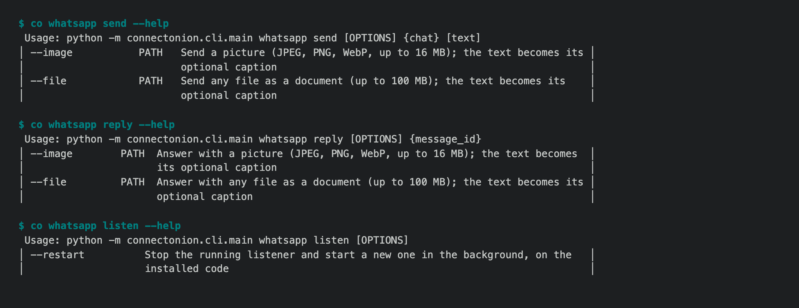

# 1.8.9b16 — People have names

An opt-in preview on the 1.8.9 fix line
([#1722](https://github.com/openonion/connectonion/issues/1722)). Stable is 1.8.8.

## People are named, not listed by address

`co wiki init` used to title a person with a bare address whenever the mail
headers carried no name. That was most of the people you write to and who have
not written back: the To line you typed held only the address.

The map now names a person, in this order, by:

1. the name they write under;
2. the name in your saved contacts (Google contacts and "other contacts",
   Outlook contacts), when your login can read them;
3. your own greeting in a mail to that one person: "Hi Larry,", "Larry 你好，",
   "子明，". A greeting to several people names none of them.

On the owner's notebook this named 176 of the 195 people who had only an
address, and changed no name the map already had. Outlook listings now keep
each recipient's name, and a header with several recipients gives each person
their own name (#1870).

## Organisations are companies, not mail servers

`accounts.google.com` and `google.com` are one organisation now, and so are
`ad.unsw.edu.au` and `unsw.edu.au`. A domain that only sends notices and has
no real correspondent gets no page. On the owner's notebook that is 138
organisations instead of 269. Pages an older map made for them move to
`.state/archived/`. Nothing is deleted.

## WhatsApp sends pictures and files

```sh
co whatsapp send CHAT --image ./shortlist.png "Tonight's three options"
co whatsapp reply MESSAGE_ID --file ./itinerary.pdf
```

`--image` sends a JPEG, PNG or WebP up to 16 MB, shown inline. `--file` sends
any file up to 100 MB as a document. The caption is optional. A missing, empty
or unsupported file is refused before anything is queued, and the error names
the fix (#1856).



These fixes come from one owner's real WhatsApp inbox, 334 messages received
and 193 sent, counted rather than read:

- **Group messages arrived with the wrong kind.** 154 of 334 were labelled
  `messagecontextinfo` instead of `text`, so a consumer that answered text
  skipped almost half of what people said (#1858).
- **A person's first message in a group was lost.** It arrives under the same
  id as an empty sender-key frame, and it was dropped as that frame's
  duplicate (#1837).
- **A listener kept running the code it started with,** through upgrades. One
  ran from 21 September through six releases, so no photo anyone sent it was
  saved. A listener now records its version, restarts itself into the
  installed code when no send is in flight, and `check` names both versions.
  `co whatsapp listen --restart` replaces a listener from before this change
  (#1859). This applies to every provider's `listen`.
- **`send` and `reply` start a listener** when none is running, as `receive`
  always did. Five of the owner's seven failed sends were a 30-second wait for
  a listener nobody had started (#1860).

## Upgrade note

A WhatsApp, Feishu, Lark or Discord listener started before this preview
cannot restart itself. After upgrading, run once:

```sh
co whatsapp listen --restart
```

## Install

```sh
python -m pip install --upgrade --pre 'connectonion==1.8.9b16'
co wiki init        # re-map: names people and folds organisations
```

## Known limits

- Some people still have no name (19 on the owner's notebook), mostly because
  their mail has no greeting. A "needs review" group for them is still to come
  (#1844).
- Reading "other contacts" needs a Google login that includes the contacts
  permission. Older logins map from the mail alone.
