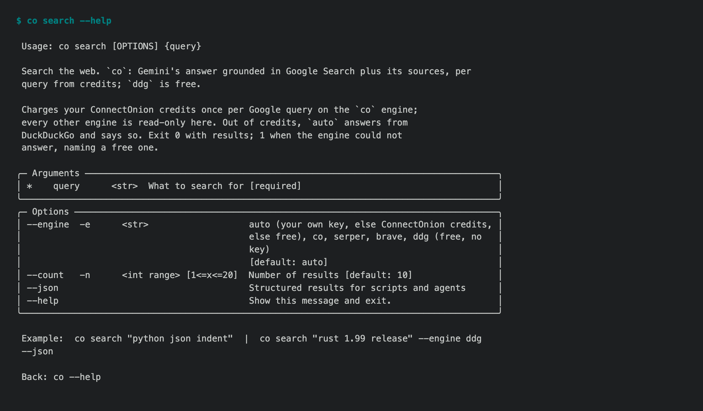
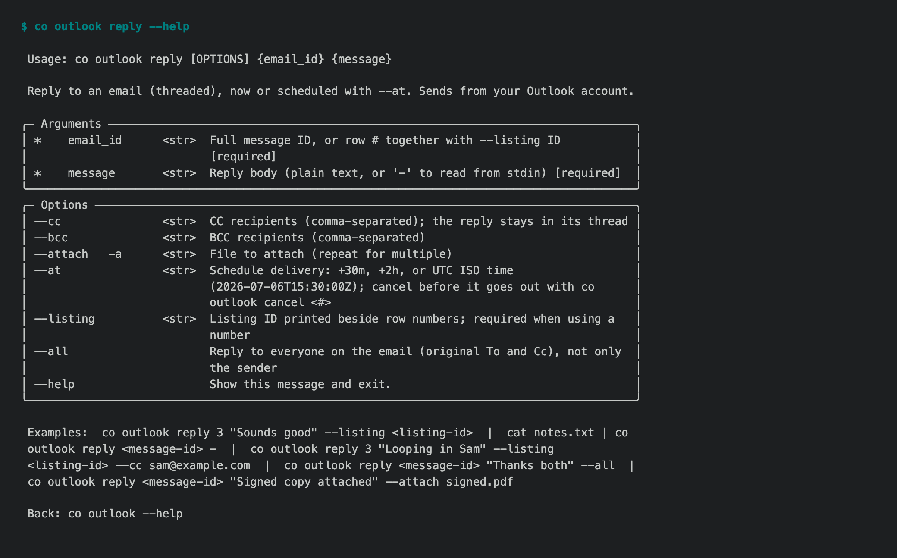

# 1.8.9b19 — Everything that was waiting

An opt-in preview on the 1.8.9 fix line
([#1722](https://github.com/openonion/connectonion/issues/1722)). Stable is 1.8.8.
This is the last preview with new features: everything that was already in a
pull request is in it. From here the 1.8.9 line takes fixes only, and new
work goes to 1.9.

## Chat turns cannot grant themselves more

A hosted agent answering a chat channel runs each turn with nobody at an
approval dialog, and anyone who can @-mention the bot can start one. Four
things change (#1881, #1873):

- With nobody to ask, a call that nothing granted is refused in every mode.
  Read-only used to let it through, because the check that would have asked a
  person just returned.
- A chat turn no longer runs a command the policy has no rule for. The
  default allow stays for the operator's own unattended jobs.
- `allowed: false` in `.co/host.yaml` denies, even inside `a && b`, and a
  deny beats any allow. It used to be skipped silently.
- A skill's `SKILL.md` frontmatter grants tools, so editing it is granting: a
  chat or unattended turn cannot do it, and with a person present it is
  always a real prompt. The refusal text no longer suggests it.

## OneNote, and one consent for Microsoft

`co auth microsoft` now asks once for everything a user can grant without an
administrator: mail, calendar, contacts, files and OneNote. If the full
request is refused, it falls back to the core set and says what was left
out; `--core` asks for the core set only (#1887). Agents get a `OneNote` tool
and people get `co onenote ls | pages | read | create`.


## Watches that call the session back

`co ai` can watch a background task or check something on a schedule, and
the result comes back into the same conversation when it happens instead of
being polled for (#1809, part of #1788).

## Search and read the web

`co search` and `co fetch`, and `web_search` / `web_fetch` for `co ai`: an
agent can look something up and read the page (#1725).



## Mail and chat

- `co outlook reply --all` answers a group thread in the same thread, and
  leaves you off the Cc of your own reply (#1834).


- A listener started again after an upgrade keeps `--raw`, and every exit
  leaves a line in the log saying why (#1882).

## Wiki

- `co wiki init` saves a complete 90-day map and keeps the mail it read as
  private materials, so investigation reads them first (#1775).
- An Investigation line names only the sources that were actually searched,
  and project map fields nested under a bullet are put back instead of the
  page being refused (#1814).
- A finished investigation waits up to 30 minutes for a scheduled update that
  holds the notebook instead of losing its page; if still busy, the error
  names where the page is kept (#1885).
- A notebook's settings that equal a default we've since replaced (the
  refused gpt-5.3-codex-spark, a 600 s turn, 300k digest pieces, 6 calls a
  day) read as today's defaults; values set with `config set` are kept
  (#1714).

## Browser

- The paid browser moves to Chromium 154 and reports the real screen it runs
  on instead of an emulated 1920×1200 at 1× (#1812, #1889).
- Chinese typed into an empty Feishu, Lark or Slate editor is entered once.
  The editor keeps an invisible character on its empty line, so a paste that
  worked looked one character short and was typed again. Any change to the
  field now counts as a landed paste; only a field that refuses the paste
  falls back to typing (#1877).

## Install

```sh
python -m pip install --upgrade 'connectonion==1.8.9b19'
```

## Known limits

- WhatsApp through the Cloud API waits until after 2.0; WhatsApp Web
  (`co whatsapp`) is the supported route in 1.8.9.
- A subject with a lot of mail still costs millions of tokens; searching the
  evidence instead is 1.9 (#1850).
