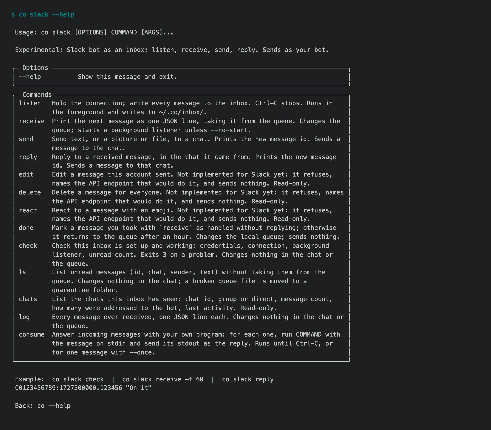

# 1.8.9b20 — OneNote on a personal account, and Slack

An opt-in preview on the 1.8.9 fix line
([#1722](https://github.com/openonion/connectonion/issues/1722)). Stable is 1.8.8.

## OneNote works on outlook.com

An hour after b19 shipped OneNote, the owner signed in on an outlook.com
account and every `co onenote` command said "Microsoft authorization expired".
Signing in again changed nothing. The token read mail; OneNote refused it with
401, code 40001. A personal Microsoft account accepts only `Notes.Create`,
`Notes.Read` and `Notes.ReadWrite`; the b19 consent asked for
`Notes.ReadWrite.All`, which is for work or school accounts only.

`co auth microsoft` now asks for `Notes.ReadWrite` as well (oo-api v0.1.26,
already live), OneNote accepts either scope, and a refusal to a sign-in without
`Notes.ReadWrite` says that a personal account needs it instead of "expired"
(#1910). If you signed in on b19 with an outlook.com account, run
`co auth microsoft` once more.

Once it signed in, the same notebook turned up three more things, all fixed:
listing the pages of a real "Quick Notes" section took Graph 6-8 seconds and
gave up at 5, so OneNote now waits up to 60; that timeout printed a Python
traceback, and a network failure is now one sentence naming the command to try
again; and a page with code clipped from the web read back with `` where its
line breaks were.

## co slack, experimental

Slack joins `co discord` and `co telegram` as an experimental inbox: a bot that
listens over Socket Mode (no public URL, no port), writes each message to the
inbox, and replies in the thread it came from. DMs to the bot and @mentions
land; with `message.channels` subscribed, so do replies in threads the bot is
in (#1909). Setup, with the exact Slack app settings: `docs/cli/slack.md`.



## Quieter on Python 3.10

A Google library warns at import that it drops Python 3.10 on 2026-10-04. On
b19 that warning printed above the output of every command that loaded a
Google tool. The CLI now hides that one notice; every other warning still
shows.

## Install

```sh
python -m pip install --upgrade 'connectonion==1.8.9b20'
```

## Known limits

- `co slack` has been tested against Slack's documented event shapes, not yet a
  real workspace. It sends text only; `edit`, `delete` and `react` refuse.
- WhatsApp through the Cloud API waits until after 2.0.
