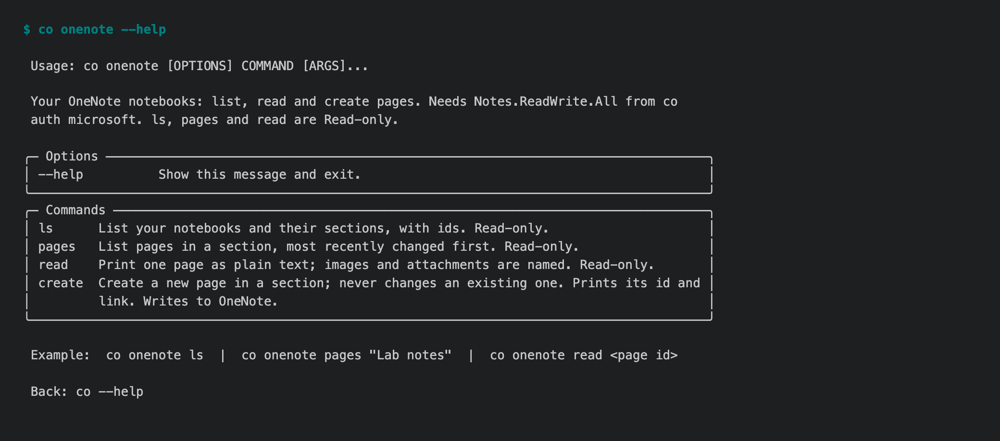
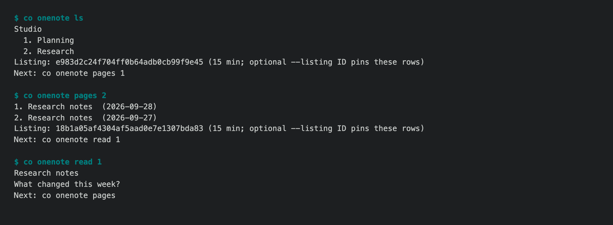

# 1.8.9b21 — OneNote by row number

An opt-in preview on the 1.8.9 fix line
([#1722](https://github.com/openonion/connectonion/issues/1722)). Stable is
1.8.8.

OneNote worked on a personal Microsoft account in b20, but reading a page
still required copying a long Graph ID or an exact, quoted name. Two sections
or pages can have the same name. The CLI now gives those lists short row
numbers ([#1915](https://github.com/openonion/connectonion/issues/1915),
[#1917](https://github.com/openonion/connectonion/pull/1917)):

```bash
co onenote ls
co onenote pages 2
co onenote read 1
```

Bare `co onenote` shows recent numbered pages across notebooks. A section
number comes from `ls`; a page number comes from `pages`. They are kept for
15 minutes under the selected Microsoft account, without caching page bodies
or titles. Re-listing replaces the default numbers; `--listing <id>` pins a
specific displayed list. Exact names and Graph IDs still work. An empty list
clears its old row references.

`co onenote create 2 "Title" "Body"` shows the notebook and section and asks
for confirmation, defaulting to No. A noninteractive script must use a full
section ID or an explicit `--listing` token. If Graph times out after a create
request, the CLI says that the page may already exist so a retry does not
silently create a duplicate.





## Install

```bash
python -m pip install --upgrade 'connectonion==1.8.9b21'
co --version
```

## Verification and limits

The CLI journey and row-safety tests passed with duplicate page titles,
an empty re-list, an account change and an expired list. `co audit co onenote`
passed all five help pages. A connected account completed `ls`, recent pages,
`read 1` and `pages 2` read-only; no page was created during live acceptance.

OneNote can take seconds to list a large section. A numbered row is a
temporary terminal convenience; keep the full ID for durable automation.
