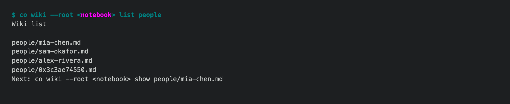

# 1.9.0a1 — the notebook looks things up instead of summarising everything

The first preview of the 1.9.0 line, where the personal notebook (being
renamed co rem, #1932) becomes long-term supported. Stable is 1.8.9.

## Investigation searches files (#1850)

Investigating the owner's own page on a real notebook took 40 model calls,
16.2M input tokens and about 75 minutes, 39 of those calls summarising chunks
of material before the one call that wrote the page.

- When the gathered material does not fit one turn, it is written to files
  instead: one per mail or attachment, one per coding session or chat, and an
  `index.md` listing them by date, sender and subject.
- Every entry starts with its source id, which is what the page cites and what
  the validator accepts.
- The one investigate turn gets the page and the index and searches with
  `rg`/`sed`, reading only what each `Unknown` field needs. No digest pass.
- The files are deleted when the run ends.

## Every turn carries less (#1851)

Each Wiki Skill now holds only rules; the stories behind them moved to
`docs/wiki-skills/`. A one-page turn's instructions:

| Turn | Before | After |
|---|---|---|
| Investigate a person | 30.6k | 14.6k |
| Investigate a project | 31.1k | 14.9k |
| Investigate an org | 63.7k | 14.6k |
| Maintain one person page | 22.9k | 14.4k |

A test holds every one-page turn under 15k characters, and
`co wiki logs --usage` reports each stage's instruction size.

## Smaller fixes



- `co wiki list people` lists the people you mail most first, the order
  investigate works through them (#1670).
- Investigating one page reads the WhatsApp chats you chose; on your own page
  it takes only what you wrote (#1625).

## Install

```sh
python -m pip install --upgrade 'connectonion==1.9.0a1'
co wiki status
```

## Known limits

- The #1850 and #1851 acceptance runs (the four measured subjects re-run on the
  same real data, compared for cost and for the facts found) are not done yet.
  This preview is how they get done.
- The command is still `co wiki`; the rename to `co rem` (#1932) comes in a
  later 1.9.0 preview.
