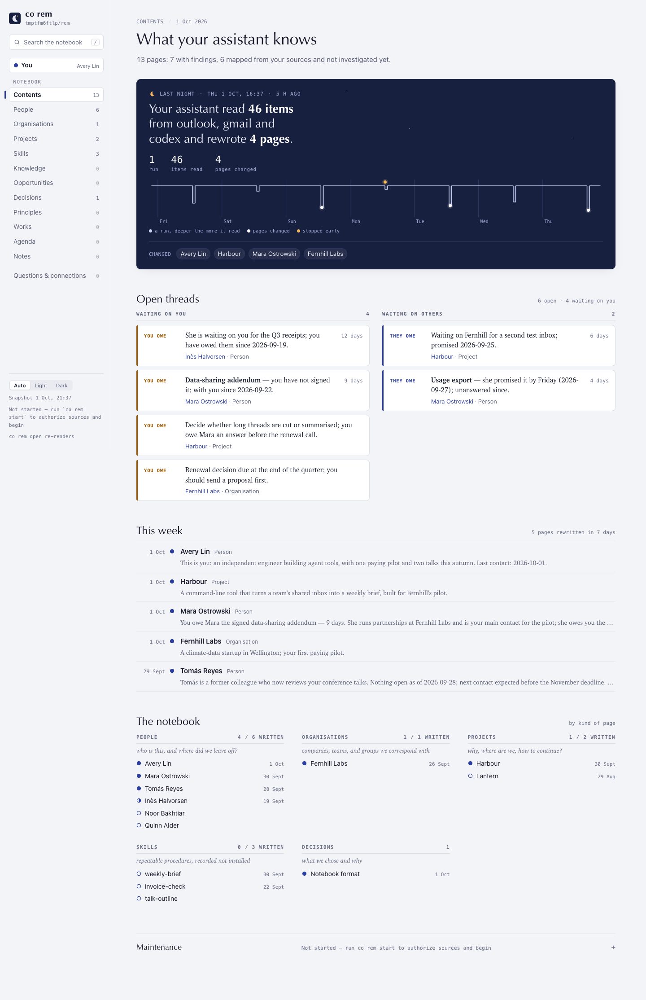
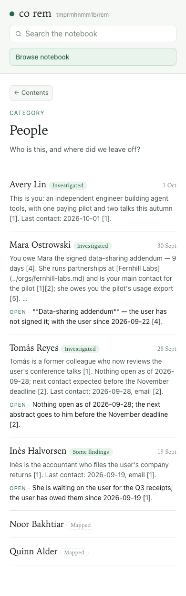
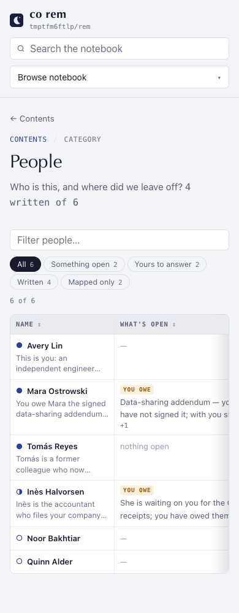
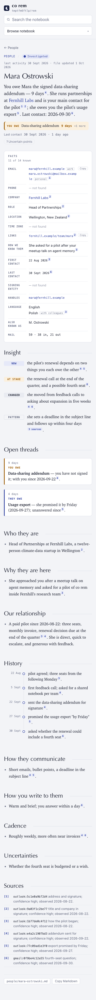

# 1.9.0a10 — REM's redesigned notebook

An opt-in preview of 1.9.0. Stable is 1.8.10. The 1.9.0a9 tag did not
publish: the release gate waited for the 1.8.10 forward ports. They are now
on `main`, and this preview includes the a9 work plus the subsequent fixes.

## Read the notebook at a glance

`co rem open` leads with what changed overnight and who is waiting on whom.
People, Organisations and Projects are sortable, filterable sheets. A row
opens its page. The old People view was a long feed; the new view shows the
person, what's open, company, role, contact details and last contact as
columns. On a phone, the sheet scrolls horizontally inside the viewport.






The person page opens on what is owed, cited Facts, Insight, open threads and
a dated History. Investigation now writes the structured Facts and Insight
blocks the reader uses (#2068). The owner address and project fixes keep more
of the first run focused on the right subjects (#2078, #2079).



The reader uses local files. Its SQLite index supports the sheets and keeps
raw messages addressable by ID. `co rem status` and the other terminal results
share the new layout from a9. Evidence is grouped by mailbox and month, which
reduced one measured person investigation from 2.77M to 1.48M input tokens.

## Skill invocation

REM already had stage Skills. `co ai` expanded the core stage Skill, but REM
also copied that same core into its task arguments. The runner now sends only
the page and source additions, so Codex receives the core once. The remaining
work in #1972 is to shorten the page, maintenance and source Skills themselves.

## Other changes carried forward

The 1.8.10 changes were merged into `main`: `environment.setting()`, `co
linear`, `co canny` and Slack reads with `co auth slack` (#2086). The preview
also includes the recent REM page cleanup, linked names, and citation links.

## Install

```sh
python -m pip install --upgrade 'connectonion==1.9.0a10'
co rem open
```

## Known limits

- Conversation sources do not yet open as a chat history (#2066).
- The remaining Skills still need the measured shortening in #1972.
- The conflicting first-run PR #2040 has not been merged into this preview.
