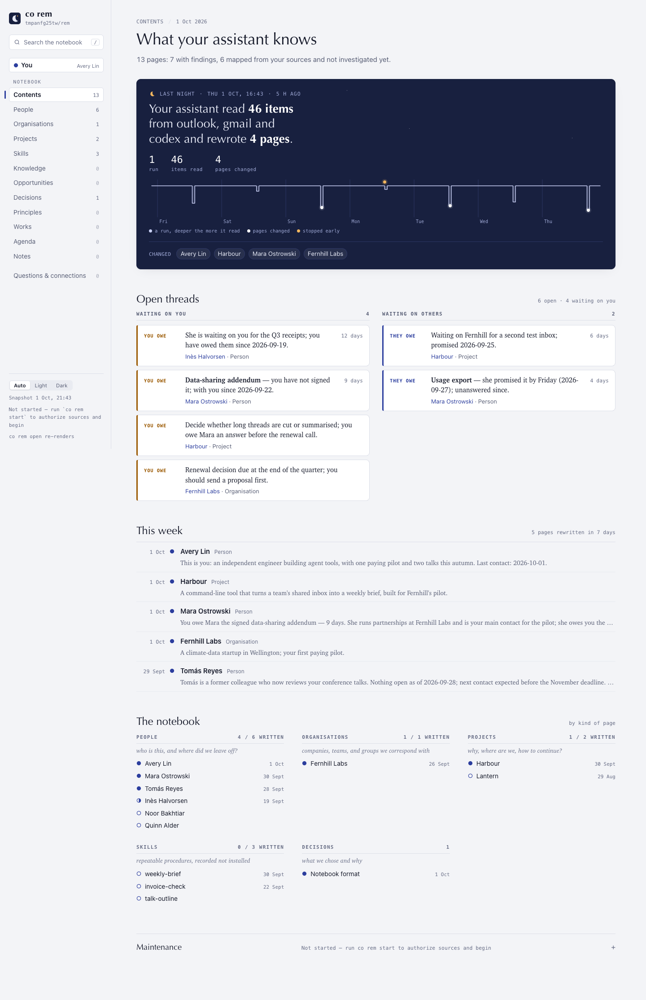
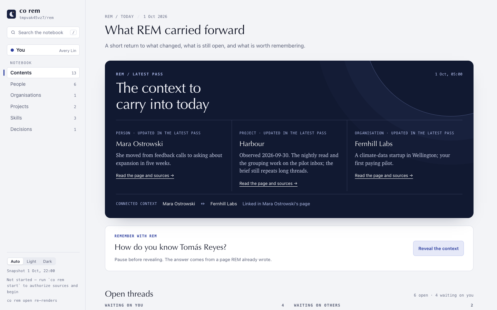
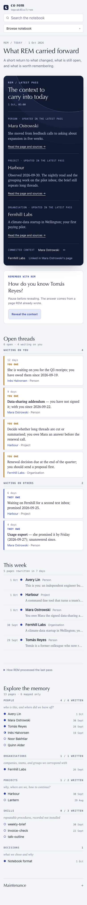
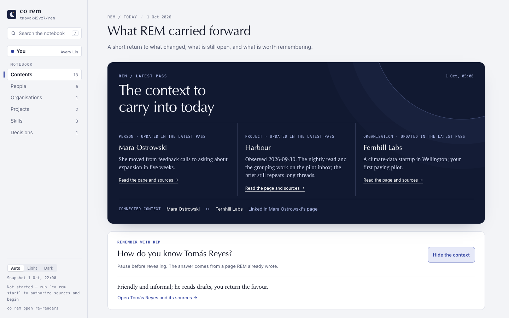

# 1.9.0a11 — REM carries context into the morning

An opt-in preview of 1.9.0. Stable is 1.8.10. The previous preview, 1.9.0a10,
introduced the redesigned reader, sortable sheets, cited Facts and Insight,
and a SQLite index. This release changes what the owner sees first.

REM is named for rapid eye movement sleep. The product should work while the
owner sleeps, connect relevant context, and help the owner remember it when
awake. The old home began with a count of what REM processed. The new home
begins with what the latest pass carried forward.




Up to three pages touched in the latest pass show one current statement each,
with a link to the page and its sources. A link already written between two
pages appears as connected context. A proposed link stays a question for
review. These cards do not claim the displayed statement was first discovered
overnight: the run log identifies rewritten pages, not claim-level changes
(#2096).

An older page becomes a “Remember with REM” question. The owner can pause,
then reveal the page's answer. The control works by keyboard and exposes its
state to assistive technology. The reveal is not saved as a retention score;
a durable, user-controlled recall loop is tracked in #2097.




Open threads remain below the brief. The last pass's counts and hypnogram
remain available in a disclosure. The phone layout no longer overlaps thread
labels with their text.

The [ranked product and design audit](../design-evidence/rem-product-audit-2026-10-01.md)
connects ten major problems to issues and gives a concrete maturity bar.
This release is a first slice of that work, not a claim that REM is mature.

## Install

```sh
python -m pip install --upgrade 'connectonion==1.9.0a11'
co rem open
```

## Known limits

- The reader is still a point-in-time, read-only HTML snapshot. Source-backed
  answers and approved actions in the live reader remain in #2071.
- The brief cannot yet compare claims before and after a pass (#2096).
- Recall feedback does not persist (#2097).
- The detail pages remain long articles; the relationship map and task-based
  retrieval remain in #2065, #2066, and #2098.
- The screenshot evidence uses an invented fixture notebook. A real notebook
  acceptance pass is required before closing the related product issues.
