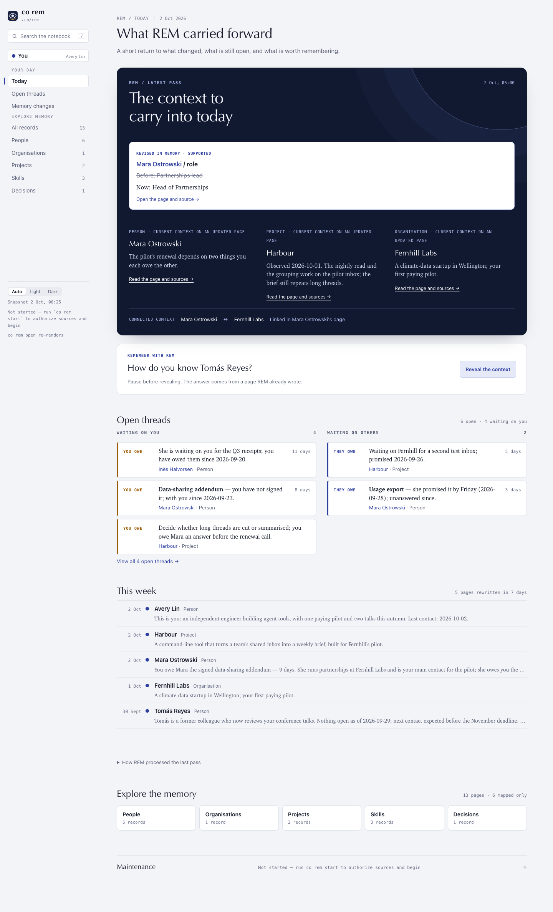
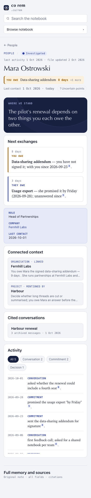
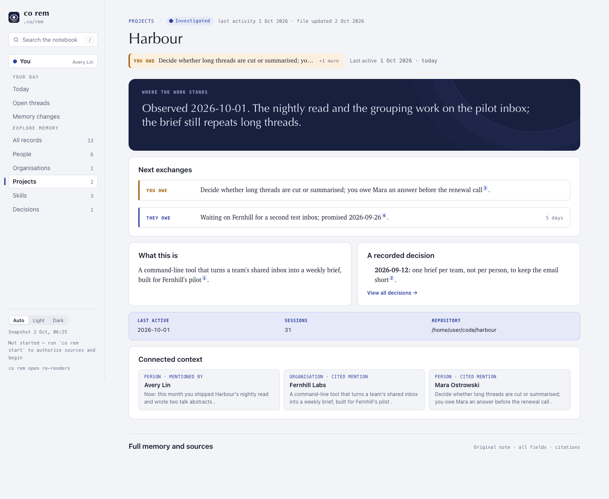
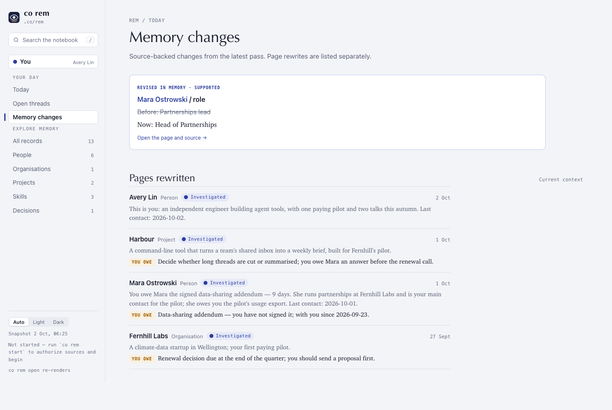
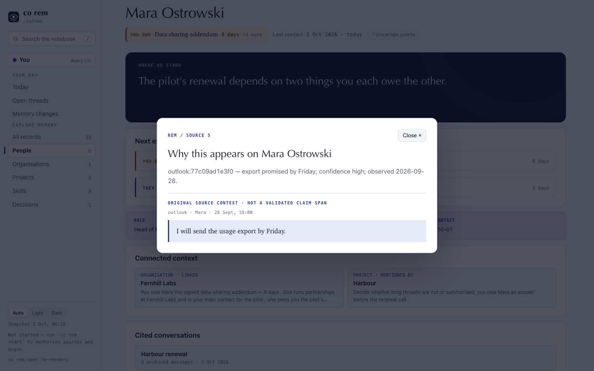

# 1.9.0a13 — REM reads like a connected memory product

This opt-in preview applies the [ranked REM design audit](../design-evidence/rem-product-audit-2026-10-01.md) to the local reader. Stable remains 1.8.10.

The home now puts a bounded morning brief, recall prompt and the most urgent open threads before recent activity. Compact category cards replace the long contents shelves. Person, organisation, project and skill pages open on a focused status, next exchanges, facts and linked context. The original Markdown and all citations remain available under **Full memory and sources**. Projects also surface their purpose and a recorded decision.





The reader finds explicit links and unambiguous name mentions between records and shows backlinks. The labels say *linked*, *cited mention*, or *mentioned by*; a mention is a navigation hint, not a verified relationship. Dated History becomes filterable Activity. **Open threads** is a dedicated action view, and search also understands common queries for obligations, memory changes and records connected to a named page.

Completed nightly passes now compare cited, keyed Facts and Contact values before and after the run. **Memory changes** shows the old and new values with source numbers, while page rewrites remain a separate list. Existing run logs have no before/after claim data, so they continue to show an honest empty state. Citation chips open an archived original excerpt when present. Cited conversations can be read in time order; the local snapshot limits each to its latest twelve archived messages and states the full count.




The new eye trace mark and night surface make the identity more recognizably REM. The interface uses explicit words and shapes for states, keeps keyboard focus visible, respects reduced motion, and makes no network request from the offline reader.

The dependency lock also advances pypdf to 6.19.0 to clear the release security audit.

The [visual review](../design-evidence/rem-connected-reader-a13/REVIEW.md) contains invented-data screenshots and a sanitized summary of the owner's private real-notebook checks. Private screenshots and message bodies were not committed.

## Install

```sh
python -m pip install --upgrade 'connectonion==1.9.0a13'
co rem open
```

Run `co rem open` again after a sync to refresh the point-in-time local HTML snapshot.

## Known limits

- The reader is still offline and read-only. It does not save recall feedback or answer free-form questions inside the page (#2097, #2071).
- Claim comparison covers cited keyed Facts and Contact values. It does not establish that a prose summary changed meaning, and older run logs cannot be compared retroactively (#2096).
- A relation inferred from a unique name mention is not a typed, verified semantic edge (#2060, #2066).
- Original excerpts require locally archived bodies in the derived index. Missing bodies are named as missing; a generated source summary is not presented as an original message (#2106).
- The project workspace and visual language are first slices of the wider template and identity acceptance criteria (#2065, #2105, #2107). The next audit should include quiet and conflicted records, relationship correction, and end-to-end morning usability.
