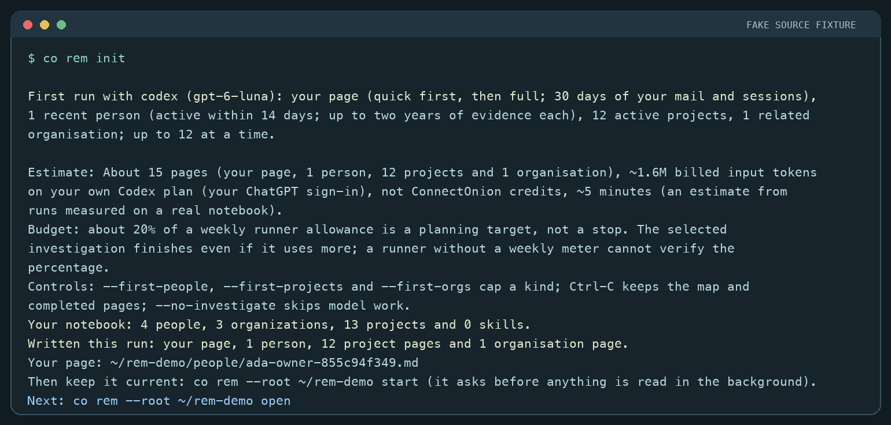

# ConnectOnion 1.9.0a14 (preview)

This preview includes the connected, task-first reader from 1.9.0a13 and makes
REM's first run investigate a useful recent set of memories by default.

`co rem init` maps connected sources, writes the owner's page, then investigates
recent important people, active projects, and organizations linked to those
people. It does this in a terminal, a script, or `--json`; `--no-investigate`
explicitly requests a map-only run. The initial announcement estimates pages,
tokens, and time before model work.
The estimate counts both owner turns and the last slow page in a parallel
wave; it uses medians from the notebook's own runs when available.

Roughly 20% of a weekly runner allowance is a target for the first run,
not a hard cap. The selected investigation can continue beyond that target;
the configured weekly safety floor still stops new pages when the runner has a
readable meter. Codex's meter reports whole percentages. Claude Code and other
runners without a readable weekly meter cannot report a measured percentage.
Manual and scheduled investigation keep their configured weekly budget.

The bundled `rem-init` Skill is short and points to the CLI workflow; the
investigation runner invokes its stage Skill once rather than repeating the
entire core in every task prompt. Selected person pages may search up to two
years of evidence. The first run runs pages concurrently, keeps completed pages
when another is refused or one archived mail body is unavailable, and preserves
the ability to retry individual failures. The reader adds labels for personal
and sensitive sentences and a local “Hide private” control.

The map and all source bodies remain local to the notebook. A successful
command does not establish that every model claim is correct: inspect cited
sources and unresolved sections. The reader is still a read-only snapshot, and
the broader page-template design review in #2065 remains open.

## Verification

In a private local seven-day first-run trial, init selected 27 pages: the
owner, 12 recent people, 11 active projects, and 3 related organizations. The
first pass accepted 26 pages and refused one person page because its History
had ten milestones against an eight-milestone limit. The repaired runner
retried that page and it was accepted. All 27 accepted pages have source
entries and none retain the uninvestigated placeholder. Median page length was
4,801 characters and median citation-marker count was 61. Those checks
measure coverage and traceability, not factual correctness. The trial used the
owner's connected sources in a private temporary notebook; no source text or
personal page was published as test evidence.

The first pass recorded 7.66 million billed input tokens and took roughly
13 minutes including mapping. Its older default estimate understated the
work, so this candidate recalibrates per-kind defaults from that run and counts
the owner's two model turns. Actual time and cost still vary by source volume,
runner, and model. The final package and browser gates are recorded in the
release PR before tagging.
