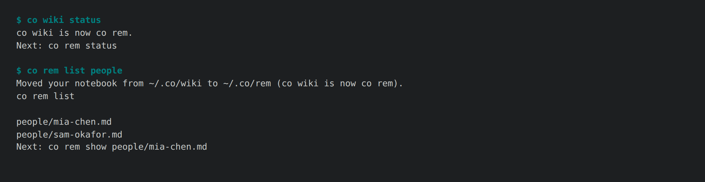

# 1.9.0a2 — co rem, by name

The second preview of the 1.9.0 line. The personal notebook is now called
**co rem** in the command, the package, the folder, the help pages and the
prompts (#1932, named in #1664). Stable is 1.8.9.

In REM sleep a day is replayed and turned into memory. co rem does the same
for your work: it reads your sessions and mail and keeps pages on the people,
projects and tools current. It is always `co rem`, never "rem" alone.

## Coming from co wiki



- The first `co rem` moves `~/.co/wiki` to `~/.co/rem`. It moves rather than
  copies, so there is one notebook. If both folders exist it refuses, names
  both, and merges nothing. An explicit `--root` is used as given, and a move
  that fails leaves the old folder whole.
- A daily schedule installed by `co wiki start` still ran `co wiki sync`. The
  first `co rem` for that notebook replaces it with one that runs
  `co rem sync`.
- `co wiki …` runs nothing in 1.9.x. It exits 2 with `co wiki is now co rem.`
  and one `Next: co rem …` line carrying the same arguments, so a script
  breaks loudly, with the fix in the message. It is removed in 1.10.
- `CO_WIKI_PROGRAM` is still read when `CO_REM_PROGRAM` is unset, with a
  one-line notice. `connectonion[wiki]` still installs the spreadsheet extra,
  which is now called `rem`.

## A first run you can read (#1943)

The owner's own first run, on 2026-09-25, took ten and a half minutes, wrote a
15,498-line log, made 532 empty pages and left the next command to be found.
`co rem init` is now one command in two parts:

- **A script, no model**, that maps your mail and coding sessions. It checks
  first that the model runner (Codex by default) is installed and signed in,
  prints one line per stage, and prints your own page the moment the map is
  done: who you write to most and where you work.
- **Then, by itself, your page and your recent projects**: your page in one
  model turn on your own plan, then the pages of projects active in the last 14
  days, one call each, the cost stated first. Ctrl-C keeps the map;
  `--no-investigate` skips it.

Addresses that look like yours are listed on one line with one command
(`co rem init --mine a,b,c`), mailboxes init read stay subscribed for the
daily round, and the next step is the same everywhere: `co rem open`, then
`co rem start`.

- **Project pages from what you told your coding agents (#1947, #1948).**
  Written from the messages you typed to Codex and Claude Code, never the
  replies. Sessions started in a workspace folder holding many repositories are
  filed under the repository they worked in (250 of 590 such messages on the
  owner's machine). `co rem projects` shows order and cost without spending;
  `co rem projects write` writes.
- **People, recent first, from new mail only (#1951).**
  `co rem investigate people` works through the people you wrote to in the last
  14 days first, a portion at a time, and updates an investigated person from
  mail since then. The #1850 baseline person went from 31 calls, 8.2M input
  tokens and 3 h 24 min to one call, 1.93M and 15 minutes.
- **A daily round that finishes and follows (#1723).** The first scheduled run
  of the day finishes unfinished pages; later runs look only at what is new, and
  a run with nothing new spends nothing.
- **A help page moves nothing.** `co rem <command> --help` carried a co wiki
  notebook over to `~/.co/rem` and replaced its schedule before printing the
  help, and did it on the owner's machine while their installed co was still
  1.8.9. Asking for help now writes nothing; the first real `co rem` command
  still carries the notebook over.

## Also in this preview

- **Addresses held for review (#1844).** A people page titled by an address
  you never wrote to is kept and linkable, but stays out of the investigation
  queue, `co rem list` and the reader's contents. It comes back when a later
  map finds a name or a reply, or when you investigate it.
  `co rem list people --review` shows these pages.
- **Quiet nights cost nothing (#1846).** A night with nothing new calls no
  model and adds no run to `co rem logs`. A page that already cites every
  message pointing at it gets no maintenance turn. `logs --usage` shows how
  many pages changed per 100k input tokens.
- **The model's tier is measured, not named (#1847).**
  `co rem config set model <m>` runs one investigation on a built-in fixture
  page and records which tier the model belongs to:
  - **agent**: it drives tools and writes the page itself.
  - **summary**: it only replies. Python gathers the evidence, the model
    answers with the page, and material that is too big is digested first,
    since this tier cannot search evidence files.

## Install

```sh
python -m pip install --upgrade 'connectonion==1.9.0a2'
co rem status
```

## Known limits

- The docs site and O Chat still say "wiki"; they live in other repositories.
  The live reader's O Chat route and its `WIKI_READ` message keep their names
  until O Chat changes them.
- An old `co wiki` schedule is replaced only when `co rem` next runs for that
  notebook. Until then the nightly job prints the new name and does nothing.
- The #1850 and #1851 acceptance runs from 1.9.0a1 are still owed.
