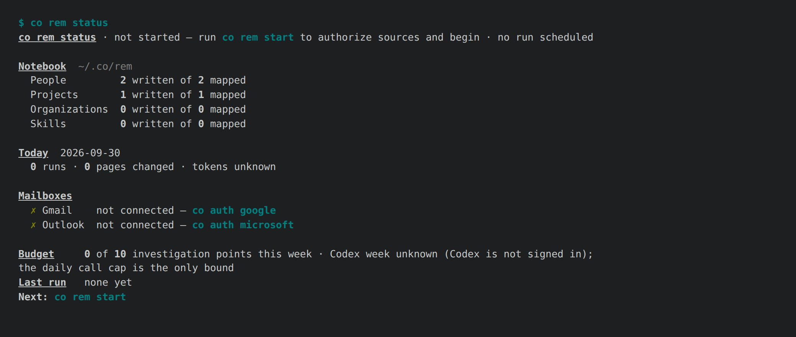
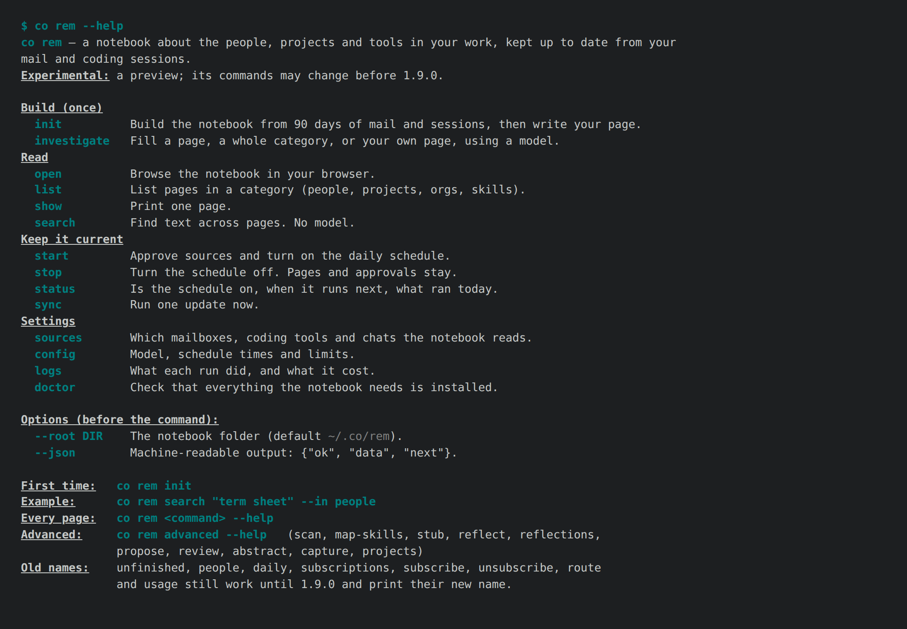

# 1.9.0a5 — co looks finished, and the first run shows your people

An opt-in preview of 1.9.0. Stable is 1.8.9.

## One look for every co command (#1997)



- **One palette.** Commands you can run are cyan, counts bold, paths dim,
  warnings yellow, errors red, and every result ends on a `Next:` line. It
  comes from one module (`connectonion/cli/style.py`), so the same thing looks
  the same wherever it appears.
- **Plain when it should be plain.** Colour follows the terminal: `NO_COLOR`,
  `TERM=dumb`, pipes, logs and launchd get plain text, and `--json` never
  changes. The words are the same either way; only the styling differs.
- **`co audit` checks it.** Each page now runs twice, once as an agent reads it
  and once as a terminal shows it. A page fails the new look rule when it has
  colour in a pipe, no colour in a terminal, or different words in the two
  runs. The help-contract test in CI fails on any such page, and the list of
  pages allowed to fail it is empty.
- **Found by the second run:** `co commands`, `co proxy --help` and all fifteen
  co rem help pages printed no colour at all. `co doctor` cut long paths to an
  ellipsis at 100 columns. All are fixed.

## co rem you can read (#1996)



- **`co rem status` is a dashboard**, not a field dump:
  - the state and the next run;
  - pages written of mapped, per category, skills included, and the next page
    to write;
  - today's runs, pages changed and tokens;
  - each mailbox with ✓ or ✗ and the command that fixes it;
  - the week's budget and the last run in one line.

  The internal fields are behind `--verbose`, and `--json` is unchanged. Next
  is the step the first line names: `init`, then `start`, then `logs` once the
  schedule runs. Before, it always said `logs`.
- **`co rem init` shows progress.** Each stage it can count (mail windows,
  bodies, session files, skills) gets a bar, and each model turn a spinner
  with its time so far. It ends by repeating the notebook's counts, which had
  scrolled away. Off a terminal it prints exactly the lines it printed before.

## A first run that shows the people around you

`co rem init` used to write your own page with the pre-#1850 quick pass (about
15k tokens of sampled mail) and no one else's page. Now, in a terminal, after
saying what it will spend:

1. **Your whole page**: `investigate me`, from everything you sent and your
   coding sessions of the last 30 days (or `--days`), in one model turn over
   evidence files. About 15 minutes.
2. **The 3 people you wrote to most in the last 14 days**, one turn each.
3. **The projects you worked on in the last 14 days**, one call each.

The whole run stops starting pages at 5 points of the Codex week, half the
notebook's weekly 10, or at the 70% floor, whichever comes first. Ctrl-C keeps
the map and every page written. `co rem investigate people` writes more
people, and `investigate me --quick` is still there by hand.

## Fixed from running it on real data (#2008)

Running this preview on the owner's real mail and sessions before tagging it
found the first run would bill over 10M input tokens while promising ~90k per
page. Fixed before release:

- **A first run that says what it will cost.** Capped at your page, 3 people
  and 3 projects (`--first-people`, `--first-projects` to change), people read
  the run's own window, and one line before anything is spent gives the pages,
  the billed input tokens and the minutes, estimated from this notebook's own
  runs. Measured: announced 1.4M, spent 1.25M (#2011).
- **Your own page has its own shape.** It says who you are and what you are
  working on from your coding sessions; a role is yours only when you say it or
  others say it of you (it had taken a partner's roles). Your name comes from
  how people address you, not the mailbox's display name (#2011).
- **A written page has no "not investigated yet" left in it**, and a project
  page draws its overview when the material shows the architecture (#2011).
- **An upgraded notebook is tidied** at its next map or sync, with nothing
  deleted: services off the people list (22 on the owner's notebook), your own
  addresses folded into your page, duplicate skills merged, old coverage lines
  removed; `--mine` never offers a real person (#2010, #1999).
- **The reader and status count from one census**: "with findings" means
  written, times are local, an interrupted run shows at once, and Next is what
  "To write next" names (#2010).
- **One look, checked for what a terminal shows**: no `[env]` lines on every
  command, `co status` on the palette with a Next line, inbox checks without
  stray colour, `co doctor` the same in a terminal and a pipe; `co audit`'s look
  rule gives stderr a terminal too and fails repeated lines, words coloured in
  pieces and status output without a Next line. 302 of 302 pages pass (#2009).
- A maintenance turn stays under 15k whatever the source, and no turn is
  pointed at the rationale docs (#2006); urllib3 2.8.0 for three new advisories
  (#2007).

## Install

```sh
python -m pip install --upgrade 'connectonion==1.9.0a5'
co rem status
co audit co rem
```

## Known limits

- The first-run estimate comes from one notebook's runs; a new machine uses
  the owner's measured defaults until it has its own.
- The docs site and O Chat still say "wiki"; they live in other repositories.
- Sharing from a page (DD-074, #1968) is designed, not built.
