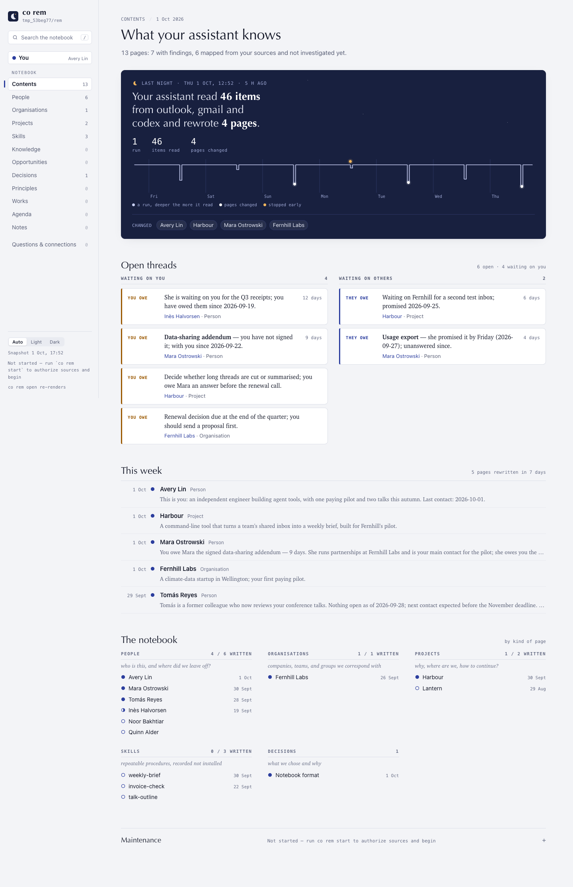
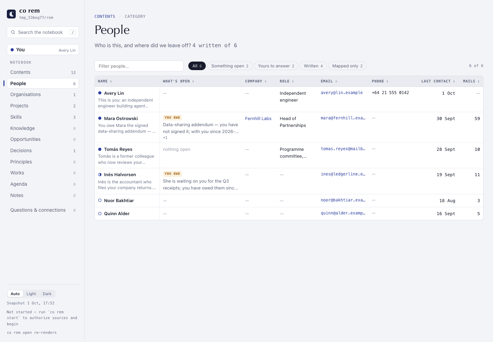
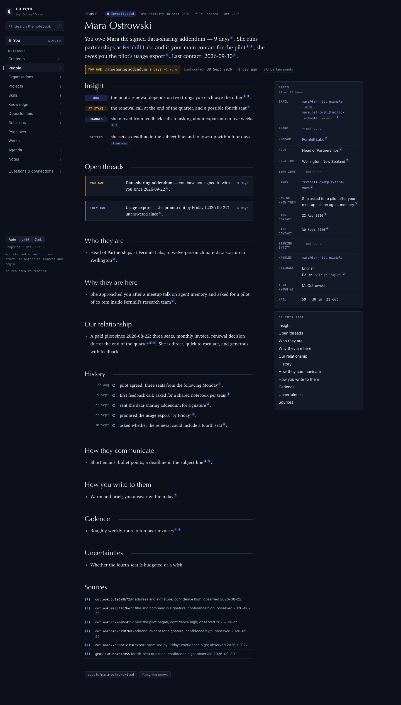
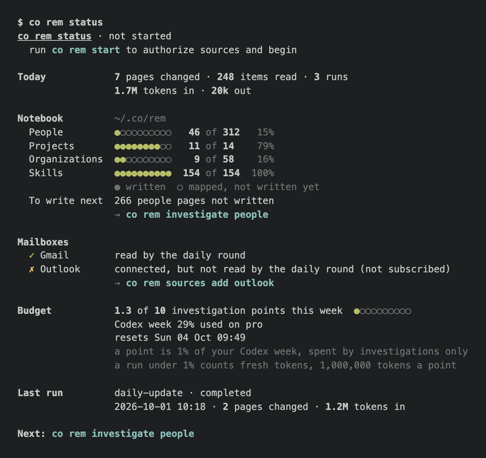

# 1.9.0a9 — the notebook, designed

An opt-in preview of 1.9.0. Stable is 1.8.9. The owner looked at co rem and
said it read like a wiki and looked generic: People should open like a CRM,
facts should be cards you can scan, and the whole thing should be designed.
An expert critique of the old reader named its ten biggest problems (#2065);
this preview answers them.

## The reader opens on the night

`co rem open` now opens on a dark "last night" band: what the last pass read
and rewrote, the week's runs drawn as a small hypnogram, and the pages that
changed. Under it, what is open: **waiting on you**, oldest first with its age,
and **waiting on others**. Then this week's changes, and the notebook by kind.



## People as a sheet

People, Organisations and Projects open as tables you can sort and filter:
name, what's open (who owes whom), company, role, email, phone, last contact,
mails. "Something open" and "Yours to answer" filter to what needs you; a row
opens the person (#2064).



## A person page opens on what is owed

A page starts with one line on the balance between you ("You owe Mara the
signed data-sharing addendum — 9 days"), then Insight (Now, At stake, Changed,
Pattern), open threads as cards, and a Facts panel where every value is cited
and a fact that was not found says so. History is a dated timeline of at most
eight milestones (#2059); citations jump to their source (#2054); a page says
"you", not "the user". Designed light and dark themes, phone width, no network.



## Leaner pages

- A person page is for someone you correspond with: on the owner's notebook
  381 people became 85, and 142 organisations 18, archived, not deleted
  (#2057).
- Lines about the tool rather than the subject are removed (#2058); the first
  mention of a person with a page links to it, project pages read the README,
  and every page is in English (#2060).
- Evidence is a month of one mailbox per file, so investigation reads less:
  one page went from 2.77M to 1.48M input tokens on the same mail (#2080).

## The terminal, designed

`co rem status` leads with today, lines every value up in one column, and
shows the notebook as written-of-mapped meters; init, sync and investigate use
the same layout and glyphs with meaning (● written, ○ mapped, ✓, ✗, ↻, →)
(#2070).



## A SQLite index beside the pages

The notebook keeps `.state/rem.db`, an owner-only index of people, orgs,
projects, messages and runs, rebuilt from its files after every map and sync
(under a second on the owner's notebook). The People sheet reads it, and
`co rem list people --table` prints it. Mail threads now carry the provider's
own thread id, ready for a conversation view (#2067).

## Install

```sh
python -m pip install --upgrade 'connectonion==1.9.0a9'
co rem open
```

## Known limits

- Investigation does not yet write the structured Facts and Insight blocks the
  reader is built for; pages written before show their Contact lines in the
  Facts panel (#2068, next preview).
- Conversations do not yet open as a chat history (#2066).
- The owner's identity is still spread over several person pages (#2078).
