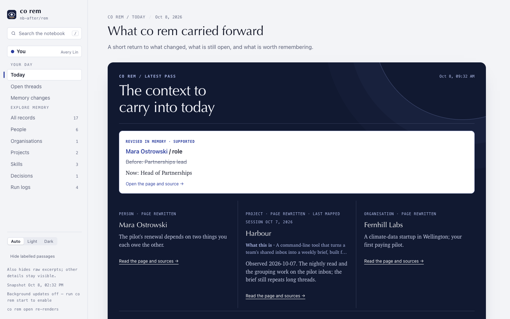

# ConnectOnion 1.9.1a1 (preview)

## Install this preview

Stable remains 1.9.0. Install this opt-in preview by exact pin:

```bash
python -m pip install --upgrade 'connectonion==1.9.1a1'
```

## Half a year in the first map

`co rem init` now maps the last **180 days** of mail by default instead of 90,
and saves the bodies for that window. People you work with every season, but
did not write to this quarter, are on the first map. `--days N` still sets any
window, and `--all-history` keeps its 180-day body archive. Mapping takes about
twice as long as a 90-day map; the init plan prints its own estimate before the
first page.

## Run logs and AI notes

In every real notebook we checked, the reader's **Notes** held only files co rem
writes for itself: the people, project and organisation maps and one run report
per installed skill. They now live in a **Run logs** category. `notes/` is shown
as **AI notes**, the AI's own working notes, and stays out of the navigation
until it holds something.

Existing notebooks move those generated files on their next `co rem` command;
skill pages keep working links to their run reports. Files you wrote in
`notes/` are not moved.



## Verification and limits

The co rem unit suite passed (2,436 tests), including new regressions that
failed on 1.9.0: run reports are written to `logs/`, and an old notebook's
generated notes move with their links. Screenshots use the invented fixture
notebook. The 180-day window has not yet had a full real init on this build;
its time and cost are recorded on [#2313](https://github.com/openonion/connectonion/issues/2313).

Next in 1.9.1: investigating each page in rounds until its evidence is read
([#2314](https://github.com/openonion/connectonion/issues/2314)), an Enrich stage
for company websites and PDFs ([#2315](https://github.com/openonion/connectonion/issues/2315)),
contact facts at the top of a person ([#2104](https://github.com/openonion/connectonion/issues/2104)),
and citations that open as the original message ([#2106](https://github.com/openonion/connectonion/issues/2106)).
