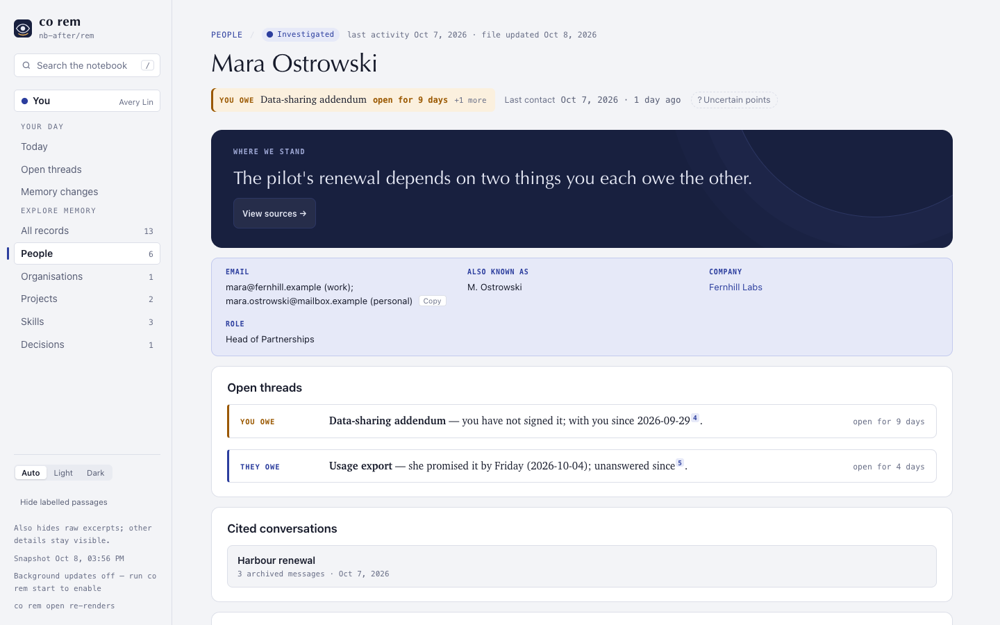
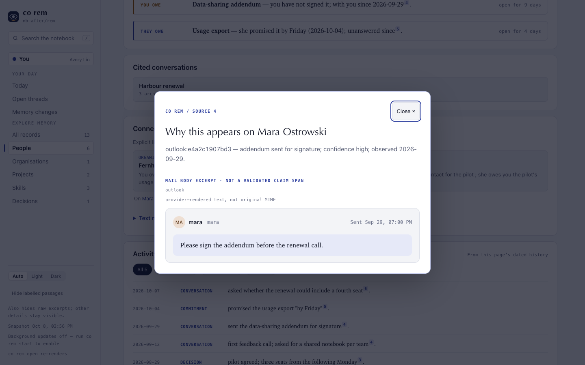

# ConnectOnion 1.9.1a2 (preview)

## Install this preview

Stable remains 1.9.0. Install this opt-in preview by exact pin:

```bash
python -m pip install --upgrade 'connectonion==1.9.1a2'
```

## Investigations read everything, in rounds

We traced 63 real Codex investigations from a 1.9.0 init. On the largest pages
the model read 3.6–8.7% of the evidence it was given (one person: 4 of 143
files), then wrote the page in one pass.

Now a page whose evidence is larger than one turn is read **in rounds**: the
material is split oldest first into parts that travel whole in the prompt, each
round edits the page the last one left and hands its open leads to the next,
and a final round rewrites the page as one account. A round that is refused
costs that round, not the page. `limits.investigation_rounds` (default 8) caps
the rounds; older material stays searchable from the first round.

On a real person with 2.3M characters of mail the page went from 13 cited
sources to 23 and gained a whole open thread the single pass had missed, for
about US$0.16 of gpt-6-luna at API prices.

## Edited, not rewritten

49 of those 63 investigations rewrote the page from scratch, and lost content
doing it (one organisation's linked people fell from 20 to 4). The page is now
the starting file: the model edits it in place and leaves every supported line
it has no reason to change. An honest "nothing new" is recorded as no change.

## Investigate like a reporter

The investigation Skill now starts from what the page does not know, follows
every name, company, attachment and request it reads as a lead, looks for how
each thread ended before writing "no reply", and records decisions with their
reasons. It ends with a lead ledger the next round picks up. Mail searches are
offered for leads, and a search the provider refuses is reported to the model
instead of ending the investigation. `History` is one line per thread with how
it ended, up to sixteen.

## Enrich: an organisation's own site

An organisation's investigation also reads its domain's home page and up to
three of its about, product, service or team pages, cited by URL. An unreadable
site is a coverage note.

## Fewer refused pages

A 1.9.0 Codex init refused 11 of 17 project pages, most for citing the run's own
coverage note or folding the mapped Sessions/First seen/Last seen lines. Both are
repaired in code before review now, on project and skill pages.

## Faster gathering

A heavy person's gather spent most of its 15 minutes asking the mail provider
for each archived message's attachments, one at a time, every run. Attachments
are fetched once, ten at a time, then read from disk: the same person's gather
took 148 seconds instead of 899.

## In the reader



A person page shows email, phone, other names, company (with what the
organisation does) and role under the headline, copyable
([#2104](https://github.com/openonion/connectonion/issues/2104)). A cited mail
opens as a message: the sender with avatar and address, recipients and Cc as
people linked to their pages, and the body
([#2106](https://github.com/openonion/connectonion/issues/2106)).



## Verification and limits

The co rem unit suite passed (2,444 tests), with regressions that failed on
1.9.1a1 first for each change above. The opt-in Chrome reader suite passed
except four tests that fail identically on 1.9.1a1
([#2320](https://github.com/openonion/connectonion/issues/2320)). The rounds
result is one real person; a full 180-day init on this build is the next
measurement. PDFs listed on a page and decisions/principles drawn from init are
not in this preview ([#2315](https://github.com/openonion/connectonion/issues/2315),
[#2314](https://github.com/openonion/connectonion/issues/2314)).
