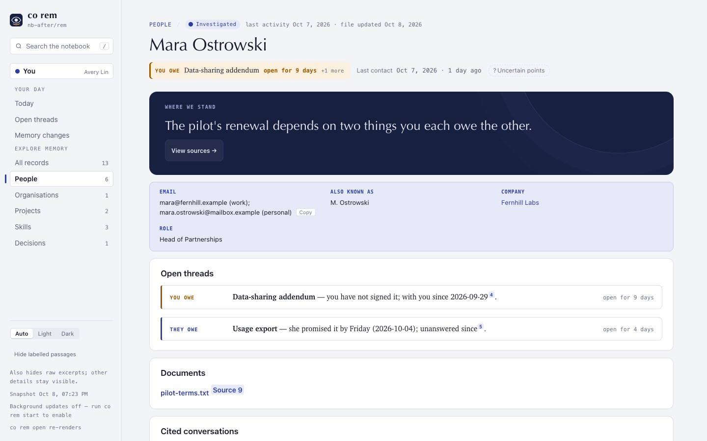

# ConnectOnion 1.9.1b1 (preview)

## Install this preview

Stable remains 1.9.0. This is the first 1.9.1 beta. Install it by exact pin:

```bash
python -m pip install --upgrade 'connectonion==1.9.1b1'
```

## What 1.9.1a2 measured

A full 180-day first run on the owner's real Gmail and Outlook, public 1.9.1a2
wheel, Codex with gpt-6-luna:

| | 1.9.0 (90 days) | 1.9.1a2 (180 days) |
|---|---|---|
| Wall time | 83 min | 169 min |
| Input / output tokens | 134M / 2.3M | 420M (90% cached) / 5.5M |
| API-equivalent cost | US$3.75 | US$10.66 |
| ChatGPT Pro weekly window used | 1 point | 4 points |
| People written | 68 of 70 | 84 of 84 |
| Organisations | 18 of 18 | 27 of 27 |
| Projects | 6 of 17 | 14 of 20 |
| Refused pages | 12 | 7 |

Every remaining project refusal was one citation. This beta fixes those, and
shortens the run.

## One citation drops its lines, not the page

After its repair turns, a project page whose only remaining problem is a
citation that cannot be traced drops the lines resting on it, as person pages
already did. Sources are counted in prose on both sides, so a source cited only
inside a diagram is removed instead of refusing the page. A skill page edited
in place keeps one Run evidence section.

## Decisions and principles from the first run

When init has written people, project or organisation pages, it ends by drawing
decisions, then principles, from them (`co rem abstract`). A failure is one line
with the retry command; the pages stay.

## Documents on the page



A page lists the attachments it cites under Documents, and each opens from the
page; a cited attachment's source popup opens the file too
([#2315](https://github.com/openonion/connectonion/issues/2315)).

## Faster

Init investigates 16 pages at a time instead of 10. Mail is fetched through one
pool per mailbox, 20 for Gmail and 8 for Outlook, instead of one shared 10 that
left half the pages in flight waiting on mail.

## Better final rounds

The synthesis round keeps every thread the earlier rounds recorded and asks for
a mail search before writing that a thread's outcome is not established.

## Verification and limits

The co rem unit suite passed, with a regression for each change that failed on
1.9.1a2 first. A full first run on this beta is the next measurement and
decides whether it becomes 1.9.1.
