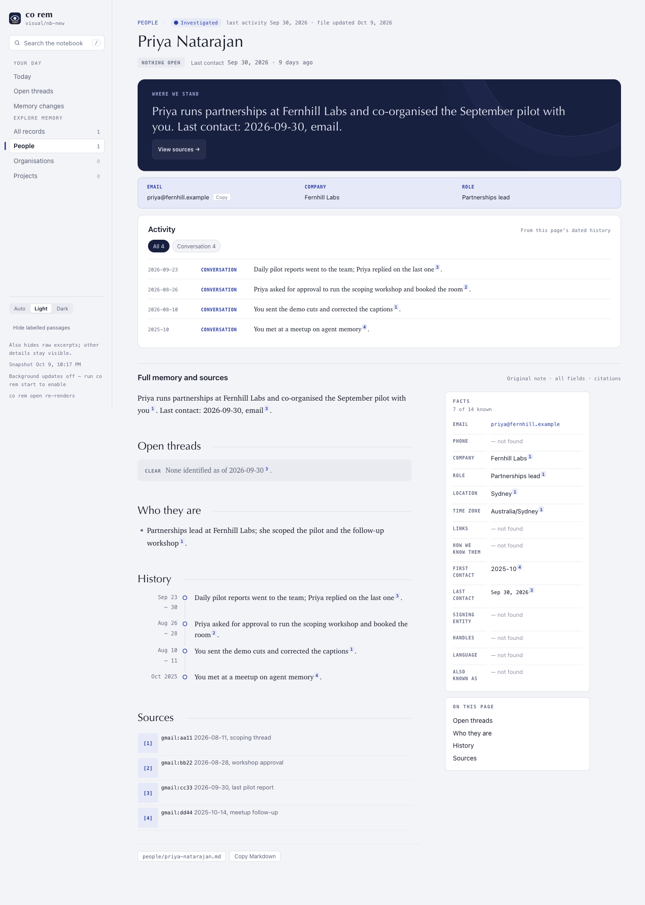

# ConnectOnion 1.9.2b2 (beta)

## Install this preview

Stable remains 1.9.1. Install this opt-in beta by exact pin:

```bash
python -m pip install --upgrade 'connectonion==1.9.2b2'
```

## A first run that loses fewer pages

Measured on the same real mailbox (180 days of Gmail and Outlook, about 290
pages, Codex gpt-6-luna):

| | 1.9.2b1 (16 workers) | first 48-worker build | later 48-worker build |
|---|---|---|---|
| Wall clock | 138 min | 130 min | 126 min |
| API-equivalent cost | $11.37 | $8.87 | $9.54 |
| Pages not written | 4 | 23 | 8 |
| Lost to the notebook lock | 0 | 14 | 0 |
| Second passes that crashed | 0 | 7 | 0 (3 had nothing older to read) |

Of the 8 pages the later build did not write, 5 are covered by fixes made after
it started. 3 were Codex routing timeouts, now retried once. 2 were refusals that
are now repaired: a removed phone left its source uncited, and a dropped
citation left half a fact uncited. The other 3 were refusals for citation
mistakes in the model's own page. This release runs 16 workers (below).

- **Each page reads at most three rounds in the first run.** The rest of its
  material stays searchable in files. This is where the cost went down.
- **Threads queue for the notebook lock.** Waiting threads used to poll it, so
  a waiter could lose to the same busy threads for ten minutes and fail.
- **A failed page gets one more try** at the end of the queue. A Codex routing
  timeout or a dropped mail connection no longer costs a page.
- **A second pass with nothing older to read ends cleanly** instead of crashing.
- **Fewer refusals:**
  - A fact part whose only citation is dropped goes, not the page.
  - A malformed search request keeps the page.
- **Pages that were not written are counted.** The closing line names how many,
  instead of printing a bare `Error:`.

The first run is back to 16 workers. 48 wrote the same work in the first 66
minutes as 16 (161 runs against 167): the model provider's throughput is the
limit, and more workers added only timeouts and lock waits.

## Right numbers on the right pages

- Your own phone is taken off every contact's page, including when each number
  carries its own citation.
- A number in another person's own signature, quoted in the thread, is named
  to the model as someone else's. If it still lands on the page, it is taken off.
  A number the person gave in their own words stays. This replaces an earlier
  rule, tried in this beta, that kept only signature numbers. That rule took
  7–8 correct numbers off pages.
- `pm.me` and home-internet mail domains (`xtra.co.nz`, `tpg.com.au`, …) are
  mailbox providers, not organisations.
- A reply that says only "hi" above a quoted `On Fri, … wrote:` no longer names
  a person "On Fri".
- Organisation pages are headed by the organisation's name, not its domain.
  Domain titles fell from 12 of 27 to 3 of 25.

## Reading the page



- "None identified", "No explicit open request" and "Nothing owed" read
  as CLEAR, not as an open thread.
- A finding written after `Unknown — not verified.` is shown, not hidden with
  the placeholder.
- History ranges keep both dates (`Aug 26` over `– 28`). A month alone reads
  `Oct 2025`. Ranged entries appear in Activity.
- "The user explicitly asks" reads "you explicitly ask", and "user-facing"
  stays "user-facing".

## Verification and limits

- **Tests:**
  - The co rem unit suite passed (2,470 tests).
  - Each fix has a regression test that fails on 1.9.2b1.
  - The reader browser suite passed except four tests that also fail on 1.9.2b1.
- **The measured run** used this beta's code before the last three fixes: the
  narrowed phone rule, the uncited-fact repair and the retry. Those are covered by
  tests, not yet by a real run.
- **Every page of a real 1.9.2b1 notebook was reviewed by hand.** 221 of 289
  pages needed a fix. What is fixed here and what remains (duplicate people,
  Company left Unknown, skill usage counts) is tracked in issue 2349.
