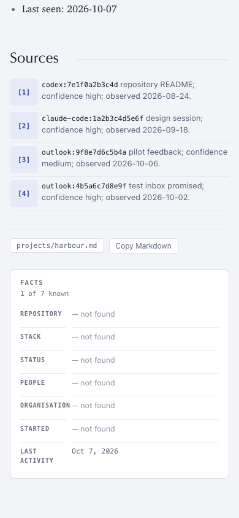

# ConnectOnion 1.9.2b3 (beta)

## Install this preview

Stable remains 1.9.1. Install this opt-in beta by exact pin:

```bash
python -m pip install --upgrade 'connectonion==1.9.2b3'
```

1.9.2b2 was built and tested but not published. Everything in the
[1.9.2b2 notes](1.9.2b2.md) is part of this beta.

## A first run you can read straight away

Measured on the same real mailbox (180 days of Gmail and Outlook, about 295
pages, Codex gpt-6-luna, 16 workers):

| | 1.9.2b2 build | 1.9.2b3 build |
|---|---|---|
| Wall clock | 126 min | 122 min |
| API-equivalent cost | $9.54 | $8.42 |
| Pages not written | 8 | 3 |
| Lost to the notebook lock | 0 | 0 |

Of the 3 pages not written, 2 left out a required section. A missing section is
now added as `Unknown` instead of the page being refused. The third cited files
outside its own material and was rightly refused.

An audit of every page, against the 1.9.2b1 notebook from the same mailbox:

| | 1.9.2b1 | 1.9.2b3 |
|---|---|---|
| Pages that pass every check | 213 of 296 | 217 of 295 |
| Sources numbered with gaps | 40 of 123 | 0 of 284 |
| Skill pages with a broken run-evidence block | 38 | 1 |
| People with Company left Unknown | 53 | 31 |
| Pages that refer to you only by name | 58 | 1 |
| Private file paths cited as sources | 2 | 0 |

- **Sources read 1, 2, 3.** When a page is written its sources are renumbered in
  order, and every citation in the text follows.
- **Company comes from the organisation page.** When a person's Company is
  Unknown and their mail domain has an organisation page, the page links it.
- **Probable duplicates are named.** At the end of the first run, init lists
  pages that are probably one person (a name and a handle, two spellings) with
  the command that merges them.
- **People are contacts you can name.** `co rem show "Ody Zhou"` finds a person
  by name, alias or email. If several pages match, it lists them with their
  emails and shows none, so a command never reaches the wrong address.
  `co rem --json list people --table` gives every contact as data.
- **Also known as holds names.** It no longer repeats the person's email
  addresses, which 64 pages did.
- **One voice.** Pages refer to you as "the user", which the reader shows as
  "you", instead of by name. The opening line says who the person is before
  what happened lately.
- **Skill pages count co ai runs.** The usage header and the run list read from
  the same records, and a skill page keeps exactly one run-evidence block.
- **Quoted replies stay out of the page.** A two-line Outlook or Apple Mail
  `From:` / `Sent:` header is cut with the quote below it.
- **An assistant's memory files are not sources.** Paths under
  `~/.claude/projects` or `~/.codex` are rejected as citations.
- **A second pass with nothing older to read** is reported as "nothing older"
  and is not retried.
- **Project pages:** a line whose citation is outside the material is dropped,
  not the whole page; a mapped project that waits for a run says how many
  sessions it will read.
- **The estimate before the first run** is calibrated from the measured run.

## Reading the page



- Facts labels never break mid-word. `REPOSITORY` and `ORGANISATION` used to
  wrap as `REPOSITOR / Y`.
- Long addresses, handles and paths break after `@` and before `.` or `/`, not
  inside a word.
- A 64-character source id shows its first 12 characters with an ellipsis; the
  full id is in the tooltip and in the Markdown.
- A connected-context card ends on a whole word with `…`.
- On a phone, a project's source action stays on the first screen.

## Verification and limits

- **Tests:**
  - The co rem unit suite passed (2,499 tests).
  - Each fix has a regression test that failed before the fix.
  - The reader browser suite passed (65 tests).
- **The measured run** used this beta's code before the last two fixes: a
  missing section added as `Unknown`, and a second pass with nothing older
  counted as nothing new. Both are covered by tests, not yet by a real run.
- **Pages read by hand** after the run were mostly detailed and cited. What
  remains is tracked in issue 2349: a thin page for a large project, four
  organisations still titled by their domain, the owner's own page opening on
  the latest task instead of who they are, and minor items listed as open
  threads.
